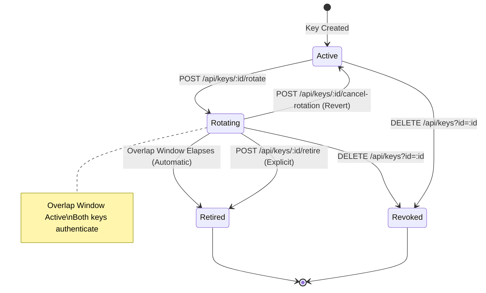

# 🔑 Customer API Key Rotation & Zero-Downtime Migration Guide

## Overview

OphirPay enables programmatic integration with smart contracts, payment streams, escrows, and webhook infrastructure via scoped API keys (`oph_<hex>`). For institutional custody and production services, secret rotation is table stakes.

The **Zero-Downtime API Key Rotation** system allows consumers to replace an existing API key with a newly generated key without service interruption:
- **Scope Parity:** The replacement key automatically inherits identical permission scopes as the original key.
- **Dual-Key Overlap Window:** Both the old key and new key authenticate simultaneously during a configurable overlap period (default: 24 hours).
- **Automated Grace Expiry:** Once the window closes, requests using the old key are rejected and explicitly inform the caller of the rotation.
- **Explicit Early Retirement:** Operators who complete their deployment early can terminate the overlap window immediately.
- **Audited Lifecycle:** Every rotation, early retirement, and cancellation is permanently tracked in the `AuditLog`.

---

## Architecture & State Machine



### Database Schema Representation
Each `ApiKey` record in Prisma contains:
- `supersededById`: Foreign key pointing to the replacement `ApiKey`.
- `rotationExpiresAt`: Timestamp when the dual-key overlap window ends.
- `revokedAt`: Timestamp when the key was explicitly retired or revoked.

---

## 1. Initiating a Key Rotation

### `POST /api/keys/[id]/rotate`
Initiates zero-downtime rotation on an existing key.

#### Request Headers
- `Cookie: ophirpay_session=...` (or wallet session)
- `x-csrf-token: <token>`
- `Content-Type: application/json`

#### Request Body (Optional)
```json
{
  "name": "Production Backend (2026-Q3)",
  "overlapWindowSeconds": 86400
}
```
- `overlapWindowSeconds` *(integer, optional, default: 86400 [24h], min: 60, max: 2592000 [30d])*: Overlap duration in seconds.
- `name` *(string, optional)*: Human-readable name for the replacement key. Defaults to `<old_name> (rotated)`.

#### Response (`201 Created`)
```json
{
  "success": true,
  "data": {
    "newKey": {
      "id": "cm1newkey001",
      "name": "Production Backend (2026-Q3)",
      "prefix": "oph_7f8a",
      "scopes": ["read:payments", "write:payments"],
      "key": "oph_7f8a9b0c1d2e3f4a5b6c7d8e9f0a1b2c3d4e5f6a7b8c9d0e"
    },
    "oldKey": {
      "id": "cm1oldkey000",
      "name": "Production Backend",
      "prefix": "oph_1a2b",
      "supersededById": "cm1newkey001",
      "rotationExpiresAt": "2026-09-25T12:00:00.000Z"
    },
    "overlapExpiresAt": "2026-09-25T12:00:00.000Z",
    "overlapWindowSeconds": 86400
  }
}
```
> [!IMPORTANT]
> The plain-text key (`oph_...`) is only returned **once** upon creation or rotation. It cannot be recovered later.

---

## 2. Authentication During the Overlap Window

During the overlap window (`now < rotationExpiresAt`):
- Both the old key (`oph_1a2b...`) and the replacement key (`oph_7f8a...`) authenticate requests with identical permission scopes.
- Zero requests fail due to deployment or rollout delays across distributed services.

---

## 3. Rejection After Overlap Expiration

Once `now >= rotationExpiresAt`, any request presented with the old key is rejected with `HTTP 401 Unauthorized` and an explicit failure reason:

```json
{
  "success": false,
  "error": {
    "code": "KEY_ROTATION_EXPIRED",
    "message": "This API key was rotated and its overlap grace period expired on 2026-09-25T12:00:00.000Z. Please use the replacement key."
  }
}
```

This ensures operators and automated log monitors can instantly pinpoint stale key deployments without confusing rotation with invalid keys or credential compromise.

---

## 4. Explicit Early Retirement & Cancellation

### Early Retirement
When all consuming services have been updated before the overlap window elapses, the old key can be immediately retired:

#### `POST /api/keys/[id]/retire`
```json
{
  "success": true,
  "data": {
    "id": "cm1oldkey000",
    "retired": true,
    "retiredAt": "2026-09-24T14:30:00.000Z"
  }
}
```
This sets `rotationExpiresAt` and `revokedAt` to the current timestamp, immediately terminating authentication for the old key.

### Cancellation & Revert
If a rotation was triggered by mistake and the operator wishes to preserve the original key:

#### `POST /api/keys/[id]/cancel-rotation`
```json
{
  "success": true,
  "data": {
    "id": "cm1oldkey000",
    "rotationCancelled": true
  }
}
```
This unlinks `supersededById` and deletes the unused replacement key.

---

## 5. Audit Trail Integration

Every step of the API key rotation lifecycle records an immutable audit log entry in the `AuditLog` table:

| Action | Actor | Target | Details Logged |
|---|---|---|---|
| `api-key:rotate` | User ID | Old Key ID | `oldKeyId`, `newKeyId`, `newKeyPrefix`, `scopes`, `overlapWindowSeconds`, `rotationExpiresAt` |
| `api-key:retire-overlap` | User ID | Old Key ID | `keyId`, `name`, `supersededById`, `retiredAt` |
| `api-key:cancel-rotation` | User ID | Old Key ID | `keyId`, `name`, `cancelledReplacementKeyId` |
| `api-key:revoke` | User ID | Key ID | `keyId` |

---

## 6. Dashboard Interface (`/keys`)

The API Keys management page provides visual indicators and controls:
1. **Overlap Active Badge:** Keys currently in rotation show an amber `ROTATING • OVERLAP ACTIVE` pill with a pulsing indicator.
2. **Countdown & Time Remaining:** Displays remaining hours/days and exact expiration date for the overlap grace period.
3. **One-Click Actions:**
   - **Rotate key:** Opens the modal to configure name and overlap duration.
   - **Retire old key now:** Allows instant shutdown once migration is verified.
   - **Cancel rotation:** Safely rolls back an unneeded rotation.
   - **Revoke:** Immediate permanent invalidation.
