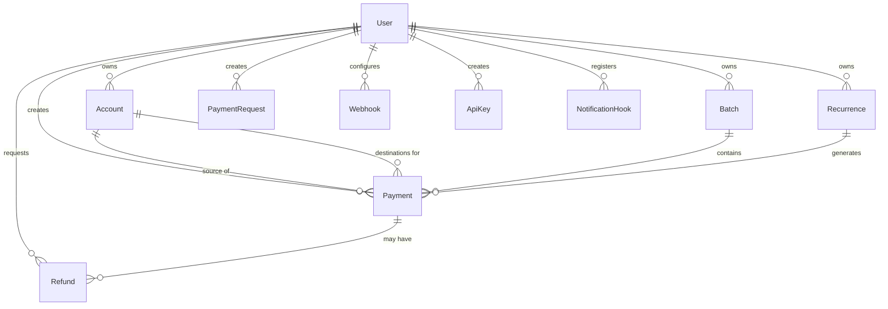

# 🗄️ Database Schema & Migration Guide

> Comprehensive architectural guide to the OphirPay PostgreSQL schema, entity relationships, safe migration authoring workflows, and zero-downtime production deployment patterns.

---

## 1. Schema Architecture & Key Entities

OphirPay uses **Prisma ORM** with **PostgreSQL** in production and **SQLite** for local development. The database models are defined in `prisma/schema.prisma`.



### Core Table Reference

| Table | Primary Key | Description | Key Foreign Keys |
| :--- | :--- | :--- | :--- |
| **`User`** | `id` (CUID) | Root identity holding Stellar public keys, email, and user profile data. | None |
| **`Account`** | `id` (CUID) | Linked Stellar accounts and labels owned by a User. | `userId → User(id)` |
| **`Payment`** | `id` (CUID) | Core transaction ledger recording amount, asset code (`XLM`/token), memo, status, and on-chain tx hash. | `userId → User(id)`<br>`sourceAccountId → Account(id)`<br>`destAccountId → Account(id)`<br>`batchId → Batch(id)`<br>`recurrenceId → Recurrence(id)` |
| **`Batch`** | `id` (CUID) | Groups multiple payments for batch processing and aggregated status tracking. | `userId → User(id)` |
| **`Recurrence`** | `id` (CUID) | Cron/scheduler configuration for recurring payment automations (`DAILY`, `WEEKLY`, `MONTHLY`). | `userId → User(id)` |
| **`PaymentRequest`** | `id` (CUID) | Invoices and payment links with lifecycle status (`PENDING`, `PAID`, `EXPIRED`, `CANCELLED`). | `userId → User(id)` |
| **`Refund`** | `id` (CUID) | On-chain Soroban refund ledger mapping DB states to `onChainId`. | `userId → User(id)`<br>`paymentId → Payment(id)` |
| **`Webhook`** | `id` (CUID) | Registered endpoints receiving HMAC-signed event notifications. | `userId → User(id)` |
| **`ApiKey`** | `id` (CUID) | Programmatic authentication storing SHA-256 `keyHash` and 8-character display `prefix`. | `userId → User(id)` |
| **`NotificationHook`** | `id` (CUID) | Mirrors on-chain Soroban event hooks to route contract signals. | `userId → User(id)` |

---

## 2. Migration Authoring Workflow

Follow these steps whenever modifying models, adding tables, or altering column constraints:

### Step 1: Update `prisma/schema.prisma`
Edit `prisma/schema.prisma` to declare your new field or table. Ensure you add necessary `@@index` annotations for columns used in query `WHERE`, `JOIN`, or `ORDER BY` clauses.

### Step 2: Generate Migration SQL (Without Applying)
Generate a clean SQL migration file using Prisma:

```bash
# Generate the migration file without immediately executing on production
npx prisma migrate dev --name <descriptive_migration_name> --create-only
```

This creates a new timestamped directory under `prisma/migrations/<timestamp>_<descriptive_migration_name>/migration.sql`.

### Step 3: Review and Refine the Migration SQL
Inspect the generated `migration.sql` file. Check for:
* Correct column types (e.g., `DECIMAL(18, 7)` for asset balances).
* Proper foreign key constraints and default values.
* Safe index creation patterns (see Section 3 below).

### Step 4: Apply and Test Locally
Apply the migration to your local database:

```bash
# Apply pending migrations locally
npx prisma migrate dev

# Regenerate Prisma Client types
npx prisma generate

# Seed sample development data
npx tsx prisma/seed.ts
```

---

## 3. Safe PostgreSQL Production Practices

### ⚠️ The `CREATE INDEX CONCURRENTLY` Caveat

In production PostgreSQL databases, creating an index with standard `CREATE INDEX` acquires an `EXCLUSIVE LOCK` on the table, blocking all concurrent `INSERT`, `UPDATE`, and `DELETE` queries until the index finishes building.

To prevent downtime on high-traffic tables (such as `Payment`), use **`CREATE INDEX CONCURRENTLY`**.

#### Critical Transaction Rule:
> **`CREATE INDEX CONCURRENTLY` CANNOT run inside a transaction block (`BEGIN ... COMMIT`).**  
> Prisma wraps migration files in a transaction block by default.

#### How to Author a Concurrent Index Migration Safely:

1. In the generated `migration.sql`, remove standard `CREATE INDEX` statements if targeting large production tables.
2. If using Prisma, mark the migration or execute non-transactional DDL scripts using custom migration runners or Prisma's `--skip-seed` flags.
3. Example valid syntax:
   ```sql
   -- Execute outside of BEGIN/COMMIT blocks
   CREATE INDEX CONCURRENTLY IF NOT EXISTS "Payment_userId_status_idx" 
   ON "Payment"("userId", "status");
   ```

---

### Zero-Downtime Schema Evolution Rules

| Operation | Unsafe Approach (Causes Outage) | Safe Zero-Downtime Approach |
| :--- | :--- | :--- |
| **Adding a `NOT NULL` Column** | `ALTER TABLE "Payment" ADD COLUMN "fee" DECIMAL NOT NULL;` | 1. Add as nullable: `ADD COLUMN "fee" DECIMAL;`<br>2. Backfill existing rows with defaults.<br>3. Set `NOT NULL` in a subsequent migration. |
| **Renaming a Column** | `ALTER TABLE "User" RENAME COLUMN "stellarAddress" TO "publicKey";` | 1. Add new column `publicKey`.<br>2. Dual-write in application layer.<br>3. Backfill data.<br>4. Deprecate and drop old column. |
| **Dropping a Column** | `ALTER TABLE "Payment" DROP COLUMN "oldField";` | Remove references in application code first, deploy code, then drop the column. |

---

## 4. Local Testing & Drift Verification

### Check for Schema Drift
Run the schema drift check to verify that your `schema.prisma` matches the migration history:

```bash
# Compare Prisma schema against migration files
npx prisma migrate diff   --from-schema-datamodel prisma/schema.prisma   --to-migrations prisma/migrations   --shadow-database-url "$SHADOW_DATABASE_URL"
```

### Resetting Local Test Database
To reset and re-run all migrations from scratch in local development:

```bash
npx prisma migrate reset --force
```

---

## 5. PostgreSQL Full-Text Search (tsvector & GIN) & SQLite Fallback

### Overview & Architecture
To support high-performance, ranked search without full table scans or unbounded `LIKE` operations, OphirPay uses native PostgreSQL **`tsvector`** generated columns and **GIN** indexes:
- **`Payment`**: Generated column `searchVector` indexes `transactionHash` (weight `A`), `memo` (weight `B`), and `description` (weight `C`).
- **`AuditLog`**: Generated column `searchVector` indexes `actor` (weight `A`), `action` (weight `B`), and `details` (weight `C`).

### Migration Definition
The search vectors are declared as stored generated columns with GIN indexes:
```sql
-- Payment generated tsvector and GIN index
ALTER TABLE "Payment" ADD COLUMN IF NOT EXISTS "searchVector" tsvector GENERATED ALWAYS AS (
  setweight(to_tsvector('simple', coalesce("transactionHash", '')), 'A') ||
  setweight(to_tsvector('english', coalesce("memo", '')), 'B') ||
  setweight(to_tsvector('english', coalesce("description", '')), 'C')
) STORED;

CREATE INDEX IF NOT EXISTS "Payment_searchVector_idx" ON "Payment" USING GIN ("searchVector");

-- AuditLog generated tsvector and GIN index
ALTER TABLE "AuditLog" ADD COLUMN IF NOT EXISTS "searchVector" tsvector GENERATED ALWAYS AS (
  setweight(to_tsvector('simple', coalesce("actor", '')), 'A') ||
  setweight(to_tsvector('simple', coalesce("action", '')), 'B') ||
  setweight(to_tsvector('english', coalesce("details"::text, '')), 'C')
) STORED;

CREATE INDEX IF NOT EXISTS "AuditLog_searchVector_idx" ON "AuditLog" USING GIN ("searchVector");
```

### Query Execution & EXPLAIN Plan
Searches leverage `to_tsquery('simple', ...)` with prefix matching (`:*`) and ranking via `ts_rank_cd`:
```sql
EXPLAIN ANALYZE
SELECT id, "transactionHash", memo,
  CASE WHEN "transactionHash" = 'hash123' THEN 1 ELSE 0 END AS exact_hash_match,
  ts_rank_cd("searchVector", to_tsquery('simple', 'hash123:*')) AS rank
FROM "Payment"
WHERE "searchVector" @@ to_tsquery('simple', 'hash123:*')
ORDER BY exact_hash_match DESC, rank DESC, id DESC;
```

**PostgreSQL EXPLAIN Output (confirming GIN index usage):**
```text
Bitmap Heap Scan on "Payment" (cost=16.02..23.13 rows=3 width=32)
  Recheck Cond: ("searchVector" @@ '''hash123'':*'::tsquery)
  -> Bitmap Index Scan on "Payment_searchVector_idx" (cost=0.00..16.02 rows=3 width=0)
        Index Cond: ("searchVector" @@ '''hash123'':*'::tsquery)
```

```text
Bitmap Heap Scan on "AuditLog" (cost=16.05..25.52 rows=6 width=32)
  Recheck Cond: ("searchVector" @@ '''refund'':*'::tsquery)
  -> Bitmap Index Scan on "AuditLog_searchVector_idx" (cost=0.00..16.05 rows=6 width=0)
        Index Cond: ("searchVector" @@ '''refund'':*'::tsquery)
```

### Relevance Ordering
Relevance ordering prioritizes matches as follows:
1. **Exact hash match** (`exact_hash_match DESC`): Exact transaction hash matches are always placed first.
2. **Text rank** (`ts_rank_cd DESC`): Considers field weights (`A` for hashes/actors, `B` for memos/actions, `C` for descriptions/details) and token density.
3. **Chronological tiebreaker** (`id DESC` / `createdAt DESC`): Breaks score ties deterministically.

### SQLite Development Fallback
SQLite does not provide native `tsvector` or GIN indexes. For local SQLite development:
- The canonical PostgreSQL schema omits raw `tsvector` column definitions from `schema.prisma` because Prisma does not natively support `tsvector` data types.
- The application layer (`src/lib/search-index.ts` and `buildPaymentWhere`) detects the database provider (`DATABASE_PROVIDER=sqlite`).
- On SQLite, search automatically falls back to case-insensitive `contains` (ILIKE-style matching) across `memo`, `description`, and exact `transactionHash` equality, ensuring local developers can run without a local PostgreSQL daemon while production benefits from GIN-indexed full-text queries.

---

## 6. Summary Checklist for Pull Requests

Before submitting a PR with database changes:
- [ ] `prisma/schema.prisma` contains clear doc comments (`///`) on all new models/fields.
- [ ] Migration generated under `prisma/migrations/` with a descriptive name.
- [ ] No blocking locks on production tables (indexes reviewed for `CONCURRENTLY` requirements).
- [ ] `npx prisma generate` builds clean TypeScript types without errors.
- [ ] Seeding script (`prisma/seed.ts`) runs successfully.
