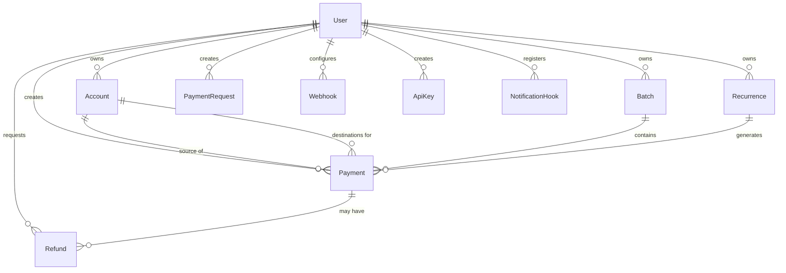

# 🗄️ Database Schema & Migration Guide

> Comprehensive architectural guide to the OphirPay PostgreSQL schema, entity relationships, safe migration authoring workflows, and zero-downtime production deployment patterns.

---

## 1. Schema Architecture & Key Entities

OphirPay uses **Prisma ORM** with **PostgreSQL** in production and **SQLite** for local development. The database models are defined in `prisma/schema.prisma`.



### Core Table Reference

| Table | Primary Key | Description | Key Foreign Keys |
| :--- | :--- | :--- | :--- |
| **`User`** | `id` (CUID) | Root identity holding Stellar public keys, email, and user profile data. | None |
| **`Account`** | `id` (CUID) | Linked Stellar accounts and labels owned by a User. | `userId → User(id)` |
| **`Payment`** | `id` (CUID) | Core transaction ledger recording amount, asset code (`XLM`/token), memo, status, and on-chain tx hash. | `userId → User(id)`<br>`sourceAccountId → Account(id)`<br>`destAccountId → Account(id)`<br>`batchId → Batch(id)`<br>`recurrenceId → Recurrence(id)` |
| **`Batch`** | `id` (CUID) | Groups multiple payments for batch processing and aggregated status tracking. | `userId → User(id)` |
| **`Recurrence`** | `id` (CUID) | Cron/scheduler configuration for recurring payment automations (`DAILY`, `WEEKLY`, `MONTHLY`). | `userId → User(id)` |
| **`PaymentRequest`** | `id` (CUID) | Invoices and payment links with lifecycle status (`PENDING`, `PAID`, `EXPIRED`, `CANCELLED`). | `userId → User(id)` |
| **`Refund`** | `id` (CUID) | On-chain Soroban refund ledger mapping DB states to `onChainId`. | `userId → User(id)`<br>`paymentId → Payment(id)` |
| **`Webhook`** | `id` (CUID) | Registered endpoints receiving HMAC-signed event notifications. | `userId → User(id)` |
| **`ApiKey`** | `id` (CUID) | Programmatic authentication storing SHA-256 `keyHash` and 8-character display `prefix`. | `userId → User(id)` |
| **`NotificationHook`** | `id` (CUID) | Mirrors on-chain Soroban event hooks to route contract signals. | `userId → User(id)` |

---

## 2. Migration Authoring Workflow

Follow these steps whenever modifying models, adding tables, or altering column constraints:

### Step 1: Update `prisma/schema.prisma`
Edit `prisma/schema.prisma` to declare your new field or table. Ensure you add necessary `@@index` annotations for columns used in query `WHERE`, `JOIN`, or `ORDER BY` clauses.

### Step 2: Generate Migration SQL (Without Applying)
Generate a clean SQL migration file using Prisma:

```bash
# Generate the migration file without immediately executing on production
npx prisma migrate dev --name <descriptive_migration_name> --create-only
```

This creates a new timestamped directory under `prisma/migrations/<timestamp>_<descriptive_migration_name>/migration.sql`.

### Step 3: Review and Refine the Migration SQL
Inspect the generated `migration.sql` file. Check for:
* Correct column types (e.g., `DECIMAL(18, 7)` for asset balances).
* Proper foreign key constraints and default values.
* Safe index creation patterns (see Section 3 below).

### Step 4: Apply and Test Locally
Apply the migration to your local database:

```bash
# Apply pending migrations locally
npx prisma migrate dev

# Regenerate Prisma Client types
npx prisma generate

# Seed sample development data
npx tsx prisma/seed.ts
```

---

## 3. Safe PostgreSQL Production Practices

### ⚠️ The `CREATE INDEX CONCURRENTLY` Caveat

In production PostgreSQL databases, creating an index with standard `CREATE INDEX` acquires an `EXCLUSIVE LOCK` on the table, blocking all concurrent `INSERT`, `UPDATE`, and `DELETE` queries until the index finishes building.

To prevent downtime on high-traffic tables (such as `Payment`), use **`CREATE INDEX CONCURRENTLY`**.

#### Critical Transaction Rule:
> **`CREATE INDEX CONCURRENTLY` CANNOT run inside a transaction block (`BEGIN ... COMMIT`).**  
> Prisma wraps migration files in a transaction block by default.

#### How to Author a Concurrent Index Migration Safely:

1. In the generated `migration.sql`, remove standard `CREATE INDEX` statements if targeting large production tables.
2. If using Prisma, mark the migration or execute non-transactional DDL scripts using custom migration runners or Prisma's `--skip-seed` flags.
3. Example valid syntax:
   ```sql
   -- Execute outside of BEGIN/COMMIT blocks
   CREATE INDEX CONCURRENTLY IF NOT EXISTS "Payment_userId_status_idx" 
   ON "Payment"("userId", "status");
   ```

---

### Zero-Downtime Schema Evolution Rules

| Operation | Unsafe Approach (Causes Outage) | Safe Zero-Downtime Approach |
| :--- | :--- | :--- |
| **Adding a `NOT NULL` Column** | `ALTER TABLE "Payment" ADD COLUMN "fee" DECIMAL NOT NULL;` | 1. Add as nullable: `ADD COLUMN "fee" DECIMAL;`<br>2. Backfill existing rows with defaults.<br>3. Set `NOT NULL` in a subsequent migration. |
| **Renaming a Column** | `ALTER TABLE "User" RENAME COLUMN "stellarAddress" TO "publicKey";` | 1. Add new column `publicKey`.<br>2. Dual-write in application layer.<br>3. Backfill data.<br>4. Deprecate and drop old column. |
| **Dropping a Column** | `ALTER TABLE "Payment" DROP COLUMN "oldField";` | Remove references in application code first, deploy code, then drop the column. |

---

## 4. Local Testing & Drift Verification

### Check for Schema Drift
Run the schema drift check to verify that your `schema.prisma` matches the migration history:

```bash
# Compare Prisma schema against migration files
npx prisma migrate diff   --from-schema-datamodel prisma/schema.prisma   --to-migrations prisma/migrations   --shadow-database-url "$SHADOW_DATABASE_URL"
```

### Resetting Local Test Database
To reset and re-run all migrations from scratch in local development:

```bash
npx prisma migrate reset --force
```

---

## 5. PostgreSQL Full-Text Search (tsvector + GIN) and the SQLite Fallback

### Why

Search used to be application-level `ILIKE` / substring matching (`src/lib/search-index.ts`,
`buildPaymentWhere`) which cannot use an index or rank results. PostgreSQL already ships
`tsvector` columns, GIN indexes and `ts_rank`, so payment and audit-log search now go
through an indexed, ranked match.

### Migration

`prisma/migrations/20260925120000_add_full_text_search/migration.sql` adds a stored
generated `searchVector` column plus a GIN index to both searchable tables:

```sql
-- Payment: transaction hash [A], memo [B], description [C]
ALTER TABLE "Payment" ADD COLUMN IF NOT EXISTS "searchVector" tsvector
  GENERATED ALWAYS AS (
    setweight(to_tsvector('simple',  coalesce("transactionHash", '')), 'A') ||
    setweight(to_tsvector('english', coalesce("memo", '')), 'B') ||
    setweight(to_tsvector('english', coalesce("description", '')), 'C')
  ) STORED;
CREATE INDEX IF NOT EXISTS "Payment_searchVector_idx"
  ON "Payment" USING GIN ("searchVector");
```

`AuditLog` receives the same treatment over `actor` [A], `action` [B] and `details` [C]
(`details` is JSONB, so the expression casts it with `::text`).

The `setweight` letters drive `ts_rank`: identity fields (hash, actor) outweigh human
text (memo, action), which outweighs long free text (description, details).

### Why the columns are not declared in `schema.prisma`

Prisma has no native `tsvector` type. Declaring these columns as
`Unsupported("tsvector")` would make `prisma migrate diff` compare a plain nullable
column against a database column that is `GENERATED ALWAYS ... STORED`, and report
schema drift on every CI run. Prisma Client never selects these columns, so they live
only in the migration and are read through `$queryRaw` —
`src/lib/full-text-search.ts` builds the fragments.

### The ranked query

The helpers build bound `$n` fragments — user input is never interpolated into SQL.
`buildPostgresMatch` produces a predicate that OR-s the indexed tsvector match with an
ILIKE fallback (so mid-word fragments still resolve) and, when the term is a transaction
hash, an exact-equality predicate:

```sql
-- $1 = tsquery, $2 = '%term%', $3 = hash (bound only for a hash-shaped query)
("searchVector" @@ to_tsquery('simple', $1)
 OR "transactionHash" ILIKE $2 ESCAPE '\'
 OR "memo"            ILIKE $2 ESCAPE '\'
 OR "description"     ILIKE $2 ESCAPE '\'
 OR "transactionHash" = $3)
```

`buildPostgresRank` produces the relevance expression:

```sql
ts_rank("searchVector", to_tsquery('simple', $n))
```

Ordering puts an exact hash match first, then tsvector relevance, then recency:

```sql
ORDER BY
  (CASE WHEN "transactionHash" = $h THEN 1 ELSE 0 END) DESC,  -- exact hash wins
  ts_rank("searchVector", to_tsquery('simple', $q)) DESC,     -- then relevance
  "createdAt" DESC, "id" DESC;                                -- then recency
```

### Confirming the GIN index

Run this against a database with the migration applied:

```sql
EXPLAIN ANALYZE
SELECT id, memo
FROM "Payment"
WHERE "searchVector" @@ to_tsquery('simple', 'invoice:*')
ORDER BY ts_rank("searchVector", to_tsquery('simple', 'invoice:*')) DESC;
```

On PostgreSQL 12+ the plan reports a `Bitmap Index Scan on "Payment_searchVector_idx"`
under a `Bitmap Heap Scan`; a `Seq Scan` there means the planner chose not to use the
index (usually because the table is tiny).

### SQLite development fallback

SQLite has no `tsvector` and no GIN index, so the local `prisma db push` path keeps the
issue #157 substring semantics through `buildFallbackWhere`, which `buildPaymentWhere`
now delegates to: case-insensitive `contains` on `memo`, plain `contains` on
`description`, and exact `equals` on `transactionHash`. The difference: Postgres ranks
and prefix-matches whole lexemes, while SQLite performs a plain `LIKE` scan — but both
return the same rows for the same terms, and the API contract is unchanged.

---

## 6. Summary Checklist for Pull Requests

Before submitting a PR with database changes:
- [ ] `prisma/schema.prisma` contains clear doc comments (`///`) on all new models/fields.
- [ ] Migration generated under `prisma/migrations/` with a descriptive name.
- [ ] No blocking locks on production tables (indexes reviewed for `CONCURRENTLY` requirements).
- [ ] `npx prisma generate` builds clean TypeScript types without errors.
- [ ] Seeding script (`prisma/seed.ts`) runs successfully.
