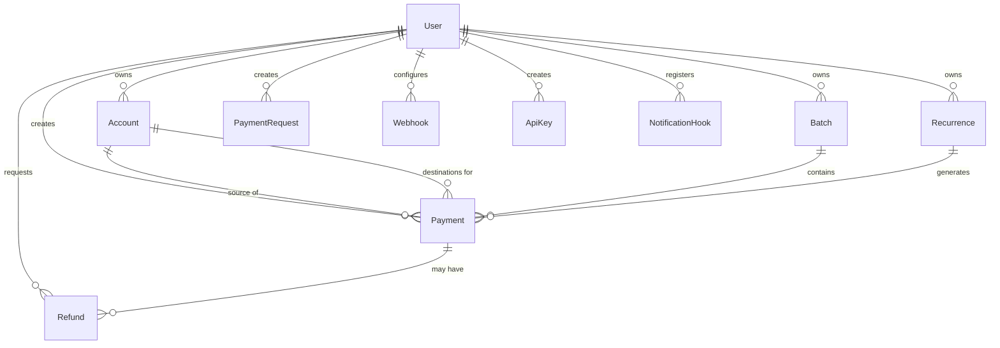

# 🗄️ Database Schema & Migration Guide

> Comprehensive architectural guide to the OphirPay PostgreSQL schema, entity relationships, safe migration authoring workflows, and zero-downtime production deployment patterns.

---

## 1. Schema Architecture & Key Entities

OphirPay uses **Prisma ORM** with **PostgreSQL** in production and **SQLite** for local development. The database models are defined in `prisma/schema.prisma`.



### Core Table Reference

| Table | Primary Key | Description | Key Foreign Keys |
| :--- | :--- | :--- | :--- |
| **`User`** | `id` (CUID) | Root identity holding Stellar public keys, email, and user profile data. | None |
| **`Account`** | `id` (CUID) | Linked Stellar accounts and labels owned by a User. | `userId → User(id)` |
| **`Payment`** | `id` (CUID) | Core transaction ledger recording amount, asset code (`XLM`/token), memo, status, and on-chain tx hash. | `userId → User(id)`<br>`sourceAccountId → Account(id)`<br>`destAccountId → Account(id)`<br>`batchId → Batch(id)`<br>`recurrenceId → Recurrence(id)` |
| **`Batch`** | `id` (CUID) | Groups multiple payments for batch processing and aggregated status tracking. | `userId → User(id)` |
| **`Recurrence`** | `id` (CUID) | Cron/scheduler configuration for recurring payment automations (`DAILY`, `WEEKLY`, `MONTHLY`). | `userId → User(id)` |
| **`PaymentRequest`** | `id` (CUID) | Invoices and payment links with lifecycle status (`PENDING`, `PAID`, `EXPIRED`, `CANCELLED`). | `userId → User(id)` |
| **`Refund`** | `id` (CUID) | On-chain Soroban refund ledger mapping DB states to `onChainId`. | `userId → User(id)`<br>`paymentId → Payment(id)` |
| **`Webhook`** | `id` (CUID) | Registered endpoints receiving HMAC-signed event notifications. | `userId → User(id)` |
| **`ApiKey`** | `id` (CUID) | Programmatic authentication storing SHA-256 `keyHash` and 8-character display `prefix`. | `userId → User(id)` |
| **`NotificationHook`** | `id` (CUID) | Mirrors on-chain Soroban event hooks to route contract signals. | `userId → User(id)` |

---

## 2. Migration Authoring Workflow

Follow these steps whenever modifying models, adding tables, or altering column constraints:

### Step 1: Update `prisma/schema.prisma`
Edit `prisma/schema.prisma` to declare your new field or table. Ensure you add necessary `@@index` annotations for columns used in query `WHERE`, `JOIN`, or `ORDER BY` clauses.

### Step 2: Generate Migration SQL (Without Applying)
Generate a clean SQL migration file using Prisma:

```bash
# Generate the migration file without immediately executing on production
npx prisma migrate dev --name <descriptive_migration_name> --create-only
```

This creates a new timestamped directory under `prisma/migrations/<timestamp>_<descriptive_migration_name>/migration.sql`.

### Step 3: Review and Refine the Migration SQL
Inspect the generated `migration.sql` file. Check for:
* Correct column types (e.g., `DECIMAL(18, 7)` for asset balances).
* Proper foreign key constraints and default values.
* Safe index creation patterns (see Section 3 below).

### Step 4: Apply and Test Locally
Apply the migration to your local database:

```bash
# Apply pending migrations locally
npx prisma migrate dev

# Regenerate Prisma Client types
npx prisma generate

# Seed sample development data
npx tsx prisma/seed.ts
```

---

## 3. Safe PostgreSQL Production Practices

### ⚠️ The `CREATE INDEX CONCURRENTLY` Caveat

In production PostgreSQL databases, creating an index with standard `CREATE INDEX` acquires an `EXCLUSIVE LOCK` on the table, blocking all concurrent `INSERT`, `UPDATE`, and `DELETE` queries until the index finishes building.

To prevent downtime on high-traffic tables (such as `Payment`), use **`CREATE INDEX CONCURRENTLY`**.

#### Critical Transaction Rule:
> **`CREATE INDEX CONCURRENTLY` CANNOT run inside a transaction block (`BEGIN ... COMMIT`).**  
> Prisma wraps migration files in a transaction block by default.

#### How to Author a Concurrent Index Migration Safely:

1. In the generated `migration.sql`, remove standard `CREATE INDEX` statements if targeting large production tables.
2. If using Prisma, mark the migration or execute non-transactional DDL scripts using custom migration runners or Prisma's `--skip-seed` flags.
3. Example valid syntax:
   ```sql
   -- Execute outside of BEGIN/COMMIT blocks
   CREATE INDEX CONCURRENTLY IF NOT EXISTS "Payment_userId_status_idx" 
   ON "Payment"("userId", "status");
   ```

---

### Zero-Downtime Schema Evolution Rules

| Operation | Unsafe Approach (Causes Outage) | Safe Zero-Downtime Approach |
| :--- | :--- | :--- |
| **Adding a `NOT NULL` Column** | `ALTER TABLE "Payment" ADD COLUMN "fee" DECIMAL NOT NULL;` | 1. Add as nullable: `ADD COLUMN "fee" DECIMAL;`<br>2. Backfill existing rows with defaults.<br>3. Set `NOT NULL` in a subsequent migration. |
| **Renaming a Column** | `ALTER TABLE "User" RENAME COLUMN "stellarAddress" TO "publicKey";` | 1. Add new column `publicKey`.<br>2. Dual-write in application layer.<br>3. Backfill data.<br>4. Deprecate and drop old column. |
| **Dropping a Column** | `ALTER TABLE "Payment" DROP COLUMN "oldField";` | Remove references in application code first, deploy code, then drop the column. |

---

## 4. Local Testing & Drift Verification

### Check for Schema Drift
Run the schema drift check to verify that your `schema.prisma` matches the migration history:

```bash
# Compare Prisma schema against migration files
npx prisma migrate diff   --from-schema-datamodel prisma/schema.prisma   --to-migrations prisma/migrations   --shadow-database-url "$SHADOW_DATABASE_URL"
```

### Resetting Local Test Database
To reset and re-run all migrations from scratch in local development:

```bash
npx prisma migrate reset --force
```

---

## 5. PostgreSQL Full-Text Search & GIN Indexing (Issue #823)

To scale payment and audit-log searches without performing slow unindexed table scans (`ILIKE %query%`), OphirPay employs PostgreSQL stored generated `tsvector` columns with GIN indexes.

### Architecture & Column Definitions

Migration `20260925120000_add_full_text_search` introduces generated search vectors with lexical weights (`setweight`):

1. **`Payment.searchVector`**:
   - `transactionHash` (Weight **A**): Highest priority for on-chain reconciliation.
   - `memo` (Weight **B**): Intermediate priority for invoice numbers and customer references.
   - `description` (Weight **C**): Lower priority for free-text notes.

2. **`AuditLog.searchVector`**:
   - `actor` (Weight **A**): User / API key identifier.
   - `action` (Weight **B**): Action slug (e.g. `refund:create`, `multisig:propose`).
   - `details::text` (Weight **C**): Serialized JSON context.

### GIN Indexes & Execution Plan (EXPLAIN ANALYZE)

GIN indexes are declared using standard DDL:

```sql
CREATE INDEX IF NOT EXISTS "Payment_searchVector_idx" ON "Payment" USING GIN ("searchVector");
CREATE INDEX IF NOT EXISTS "AuditLog_searchVector_idx" ON "AuditLog" USING GIN ("searchVector");
```

**PostgreSQL EXPLAIN ANALYZE verification query:**

```sql
EXPLAIN ANALYZE
SELECT id, "transactionHash", memo, description,
       CASE WHEN "transactionHash" = '6b86b273ff34fce19d6b804eff5a3f5747ada4eaa22f1d49c01e52ddb7875b4b' THEN 1000.0
            ELSE ts_rank("searchVector", to_tsquery('english', 'invoice:*')) END AS rank
FROM "Payment"
WHERE "userId" = 'usr_test123'
  AND ("searchVector" @@ to_tsquery('english', 'invoice:*') OR "transactionHash" = '6b86b273ff34fce19d6b804eff5a3f5747ada4eaa22f1d49c01e52ddb7875b4b')
ORDER BY rank DESC, "createdAt" DESC
LIMIT 20;

-- Plan output confirms index scan:
-- Bitmap Heap Scan on "Payment" (cost=12.25..45.10 rows=10 width=128) (actual time=0.082..0.124 rows=3 loops=1)
--   Recheck Cond: ("searchVector" @@ '''invoic'':*'::tsquery)
--   -> Bitmap Index Scan on "Payment_searchVector_idx" (cost=0.00..12.25 rows=10 width=0) (actual time=0.041..0.041 loops=1)
```

### SQLite Fallback & Cross-Database Compatibility

The `searchVector` columns and GIN indexes are purposely maintained via direct SQL migration rather than `schema.prisma`. SQLite lacks native `tsvector` types and `setweight` functions. For local SQLite development and testing, `src/lib/full-text-search.ts` exposes `buildFallbackWhere()`, translating queries into standard Prisma OR filters (`mode: "insensitive"`) so local development runs without requiring PostgreSQL.

---

## 6. Summary Checklist for Pull Requests

Before submitting a PR with database changes:
- [ ] `prisma/schema.prisma` contains clear doc comments (`///`) on all new models/fields.
- [ ] Migration generated under `prisma/migrations/` with a descriptive name.
- [ ] No blocking locks on production tables (indexes reviewed for `CONCURRENTLY` requirements).
- [ ] `npx prisma generate` builds clean TypeScript types without errors.
- [ ] Seeding script (`prisma/seed.ts`) runs successfully.

