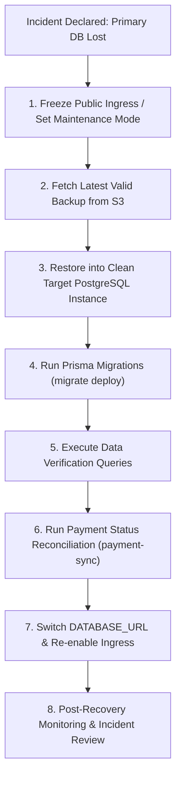
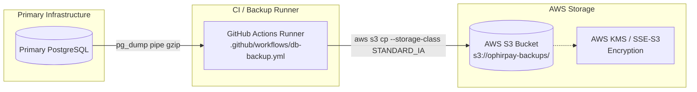
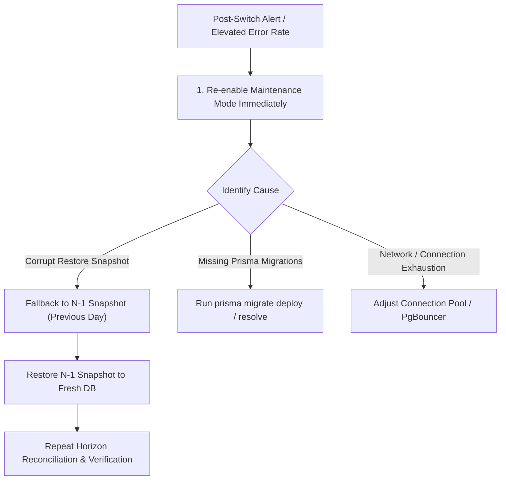

# 🚨 Disaster Recovery Runbook & Restore Procedures

> **Purpose:** Canonical disaster recovery (DR) procedures for OphirPay. Defines Recovery Point Objective (RPO) and Recovery Time Objective (RTO), backup storage and retention policies, step-by-step restoration workflows, post-restore database verification, on-chain ledger reconciliation, and incident communication protocols.
>
> **Last Audited:** 2026-09-24  
> **Target Environment:** PostgreSQL 16+, AWS S3, Stellar / Soroban Mainnet & Testnet  
> **Related Documents:** [DEPLOYMENT.md](DEPLOYMENT.md) · [SECRETS_ROTATION.md](SECRETS_ROTATION.md) · [SECURITY.md](../SECURITY.md)

---

## Table of Contents

- [1. Executive Summary & Emergency Checklist](#1-executive-summary--emergency-checklist)
- [2. Recovery Objectives (RPO & RTO)](#2-recovery-objectives-rpo--rto)
- [3. Backup Architecture & Retention Policy](#3-backup-architecture--retention-policy)
- [4. Step-by-Step Restoration Procedures](#4-step-by-step-restoration-procedures)
  - [4.1 Scenario A: Automated Disposable Drill (`scripts/restore-drill.sh`)](#41-scenario-a-automated-disposable-drill-scriptsrestore-drillsh)
  - [4.2 Scenario B: Production Emergency Database Recovery](#42-scenario-b-production-emergency-database-recovery)
- [5. Post-Restore Data Verification Queries](#5-post-restore-data-verification-queries)
- [6. Blockchain vs. Database Reconciliation](#6-blockchain-vs-database-reconciliation)
  - [6.1 The Immutability Gap ($T_{\text{restore}}$ to $T_{\text{outage}}$)](#61-the-immutability-gap-t_textrestore-to-t_textoutage)
  - [6.2 In-Flight Payments Reconciliation (`payment-sync.ts`)](#62-in-flight-payments-reconciliation-payment-syncts)
  - [6.3 On-Chain Horizon Log Audit & Backfill](#63-on-chain-horizon-log-audit--backfill)
  - [6.4 Webhook Delivery Considerations](#64-webhook-delivery-considerations)
- [7. Traffic Switching & Rollback Plan](#7-traffic-switching--rollback-plan)
- [8. Incident Communication & Status Updates](#8-incident-communication--status-updates)
- [9. Tested vs. Untested / Manual Matrix & Follow-Up Checklist](#9-tested-vs-untested--manual-matrix--follow-up-checklist)

---

## 1. Executive Summary & Emergency Checklist

In the event of total loss, corruption, or catastrophic failure of the primary PostgreSQL database:



### Emergency Runbook Quick Reference

1. **Declare Incident & Stop Ingress:** Put frontend/API into maintenance mode to prevent split-brain writes.
2. **Identify Latest Backup:**
   ```bash
   aws s3 ls s3://ophirpay-backups/ | grep '\.sql\.gz$' | sort -k1,2 | tail -1
   ```
3. **Download & Verify Archive:**
   ```bash
   aws s3 cp s3://ophirpay-backups/<BACKUP_FILE>.sql.gz ./
   gzip -t <BACKUP_FILE>.sql.gz
   ```
4. **Restore to Fresh Database:**
   ```bash
   gunzip -c <BACKUP_FILE>.sql.gz | psql "$RESTORE_DATABASE_URL" --single-transaction --set ON_ERROR_STOP=1
   ```
5. **Apply Any Pending Schema Migrations:**
   ```bash
   DIRECT_DATABASE_URL="$RESTORE_DATABASE_URL" DATABASE_URL="$RESTORE_DATABASE_URL" npx prisma migrate deploy
   ```
6. **Reconcile On-Chain Transactions with Stellar:**
   Run Horizon status reconciliation pass (`runPaymentStatusSync`) for submitted payments.
7. **Repoint Ingress & Resume Traffic:** Update `DATABASE_URL` across Vercel / Kubernetes secrets and monitor `/api/health`.

---

## 2. Recovery Objectives (RPO & RTO)

### 2.1 Recovery Point Objective (RPO): 24 Hours

* **Target Value:** **24 hours** (maximum data loss window).
* **How It Is Met:**
  - Automated database backups run once daily at **03:00 UTC** via GitHub Actions workflow `.github/workflows/db-backup.yml` (`cron: "0 3 * * *"`).
  - Backups are dumped with `pg_dump --no-owner --no-acl`, compressed via `gzip`, and uploaded to AWS S3.
* **Limitations & Risk Profile:**
  - **No Continuous WAL Archiving / PITR:** Continuous Write-Ahead Log (WAL) archiving is currently not enabled. If an outage occurs at 02:59 UTC, up to 23 hours and 59 minutes of off-chain database transactions may be lost from the database tier.
  - *Mitigation:* Stellar ledger transactions remain immutable on-chain; missing off-chain records must be reconstructed via Horizon reconciliation (see [Section 6](#6-blockchain-vs-database-reconciliation)).

### 2.2 Recovery Time Objective (RTO): Target < 1 Hour (Currently Unbenchmarked)

* **Target Value:** **< 1 hour (30–60 minutes)** from incident declaration to traffic restoration.
* **Current Operational Status:** **Unbenchmarked / Untested in production.** The restoration drill script (`scripts/restore-drill.sh`) tests recovery into a local ephemeral Docker container, but automated production-scale failover has not yet been timed under live emergency conditions.
* **Estimated Component Breakdown:**
  | Step | Estimated Duration | Dependencies |
  |---|---|---|
  | Incident confirmation & maintenance mode | 3–5 min | Cloudflare / Vercel DNS / edge proxy |
  | S3 archive download (~200MB–2GB) | 2–5 min | AWS network throughput |
  | Target PostgreSQL provisioning | 5–15 min | Cloud DB (RDS / Supabase / Neon) provision API |
  | Single-transaction `psql` restore | 5–20 min | DB compute & I/O speed |
  | Prisma migration verification | 2–3 min | `npx prisma migrate deploy` |
  | SQL sanity & row-count checks | 2–5 min | Operational queries |
  | On-chain Stellar reconciliation pass | 5–10 min | Horizon API rate limits |
  | Ingress traffic rerouting & health check | 3–5 min | Environment variable propagation / restarts |
  | **Total Estimated Recovery Time** | **27–68 min** | Meets < 1 hour target under optimal conditions |

---

## 3. Backup Architecture & Retention Policy

### 3.1 Infrastructure Overview



### 3.2 Configuration Parameters

* **S3 Bucket:** `s3://ophirpay-backups/` (configured via `BACKUP_BUCKET` env var, defaults to `ophirpay-backups`).
* **Storage Class:** `STANDARD_IA` (Infrequent Access) for cost-effective durability.
* **Encryption:** Encrypted at rest via AWS S3-managed keys (`SSE-S3`) or AWS KMS (`aws:kms`).
* **Retention Policy:** **30 Days** (`BACKUP_RETENTION_DAYS: 30`).
  - The backup workflow computes a cutoff date (`date -d "-30 days" -u +"%Y-%m-%d"`).
  - Any S3 archive with a datestamp older than 30 days is automatically purged during the daily cleanup phase.
* **Archive Naming Convention:**
  ```text
  ophirpay-YYYY-MM-DDTHH-MM-SSZ.sql.gz
  Example: ophirpay-2026-09-24T03-00-12Z.sql.gz
  ```
* **Required GitHub Actions Secrets:**
  - `DB_HOST`, `DB_USER`, `DB_PASSWORD`, `DB_NAME`: Database credentials.
  - `AWS_ACCESS_KEY_ID`, `AWS_SECRET_ACCESS_KEY`, `AWS_REGION`: AWS IAM credentials with `s3:PutObject`, `s3:ListBucket`, and `s3:DeleteObject` permissions on `s3://ophirpay-backups/*`.

### 3.3 Manual Backup Trigger

To force an out-of-band backup prior to high-risk maintenance:

```bash
gh workflow run db-backup.yml
```

Or via GitHub Web UI: **Actions** → **Database Backup** → **Run workflow**.

---

## 4. Step-by-Step Restoration Procedures

### 4.1 Scenario A: Automated Disposable Drill (`scripts/restore-drill.sh`)

Use this script for non-destructive monthly validation drills or staging tests. It spins up an ephemeral PostgreSQL Docker container on port `5433`, restores the latest backup, runs row-count assertions against canonical Prisma models, and tears down the container.

#### Prerequisites
- Docker installed and daemon running.
- AWS CLI configured with read access to `s3://ophirpay-backups/`.
- `psql` (PostgreSQL client) installed locally.

#### Invocation
```bash
export AWS_ACCESS_KEY_ID="<your-key>"
export AWS_SECRET_ACCESS_KEY="<your-secret>"
export AWS_REGION="us-east-1"
export BACKUP_BUCKET="ophirpay-backups"

./scripts/restore-drill.sh
```

#### What the Drill Executes
1. Queries `s3://${BACKUP_BUCKET}/` for the latest `.sql.gz` archive.
2. Downloads the file to the local directory.
3. Starts a temporary Docker container `ophirpay-restore-drill-<PID>` on port `5433`.
4. Executes `gunzip -c | docker exec -i ... psql -U postgres -d ophirpay_drill --single-transaction --set ON_ERROR_STOP=1`.
5. Queries row counts for canonical Prisma models: `User`, `Account`, `Payment`, `Batch`, `PaymentRequest`, `Webhook`, `ApiKey`.
6. Sets `PASS=false` and returns exit code 1 if any table check fails.
7. Automatically cleans up the Docker container and downloaded archive via bash `EXIT` trap.

---

### 4.2 Scenario B: Production Emergency Database Recovery

Follow these steps if the primary database is lost, corrupted, or unrecoverable.

#### Step 1: Declare Incident & Enable Maintenance Mode
Halt user traffic immediately to stop writes from diverging:
- **Vercel:** Route incoming traffic to a static 503 maintenance page or set maintenance middleware.
- **Kubernetes:** Scale app deployment replicas to 0 or update ingress to redirect to maintenance:
  ```bash
  kubectl scale deployment/ophirpay --replicas=0 -n ophirpay
  ```

#### Step 2: Provision Target PostgreSQL Database
Create a clean PostgreSQL 16+ database instance (via AWS RDS, Supabase, Neon, or self-hosted).
Record the target direct connection URL:
```bash
export RESTORE_DATABASE_URL="postgresql://ophirpay:<SECURE_PASSWORD>@<NEW_HOST>:5432/ophirpay"
```

#### Step 3: Fetch Target Backup from S3
List and download the desired backup snapshot:
```bash
# List available snapshots (sorted by timestamp)
aws s3 ls s3://ophirpay-backups/ | grep '\.sql\.gz$' | sort -k1,2

# Set chosen snapshot filename
BACKUP_FILE="ophirpay-2026-09-24T03-00-12Z.sql.gz"

# Download to recovery workspace
aws s3 cp "s3://ophirpay-backups/${BACKUP_FILE}" "./${BACKUP_FILE}"
```

#### Step 4: Validate File Integrity
Verify the archive is complete and uncorrupted:
```bash
# Verify gzip integrity (returns 0 on success)
gzip -t "${BACKUP_FILE}" || { echo "Archive corrupt!"; exit 1; }

# Inspect initial SQL headers
gunzip -c "${BACKUP_FILE}" | head -n 30
```

#### Step 5: Restore Database in a Single Transaction
Restore the SQL dump into the target database.
> [!IMPORTANT]
> Always execute with `--single-transaction --set ON_ERROR_STOP=1` so that any SQL failure aborts the entire restoration, preventing a partially populated, corrupted schema state.

```bash
gunzip -c "${BACKUP_FILE}" | psql "$RESTORE_DATABASE_URL" \
  --single-transaction \
  --set ON_ERROR_STOP=1 \
  --echo-errors
```

#### Step 6: Apply Pending Prisma Migrations
If application code has deployed new migrations since the backup was generated, synchronize the schema:
```bash
DIRECT_DATABASE_URL="$RESTORE_DATABASE_URL" \
DATABASE_URL="$RESTORE_DATABASE_URL" \
npx prisma migrate deploy
```

---

## 5. Post-Restore Data Verification Queries

Before redirecting application traffic to the restored database, run these verification queries using `psql "$RESTORE_DATABASE_URL"`:

### 5.1 Verify Key Table Counts
Confirm core business tables exist and contain valid records:

```sql
SELECT 
  'User' as model, count(*) from "User"
UNION ALL
SELECT 'Account', count(*) from "Account"
UNION ALL
SELECT 'Payment', count(*) from "Payment"
UNION ALL
SELECT 'Batch', count(*) from "Batch"
UNION ALL
SELECT 'PaymentRequest', count(*) from "PaymentRequest"
UNION ALL
SELECT 'Webhook', count(*) from "Webhook"
UNION ALL
SELECT 'ApiKey', count(*) from "ApiKey"
UNION ALL
SELECT 'Refund', count(*) from "Refund";
```

### 5.2 Determine Snapshot Cutoff Timestamp ($T_{\text{restore}}$)
Identify the exact timestamp of the newest records in the restored database:

```sql
SELECT 
  MAX("createdAt") AS latest_payment_created,
  MAX("updatedAt") AS latest_payment_updated
FROM "Payment";
```
*Record this timestamp as $T_{\text{restore}}$ (e.g. `2026-09-24T03:00:12Z`). All transactions confirmed on Stellar after this time require reconciliation.*

### 5.3 Audit In-Flight Payment States
Check distribution of payments that were pending/submitted when the backup ran:

```sql
SELECT status, count(*) 
FROM "Payment" 
GROUP BY status 
ORDER BY count(*) DESC;
```
*Note: Any payment in `SUBMITTED`, `PROCESSING`, or `PENDING` must be verified against Horizon.*

### 5.4 Relational Integrity Check
Verify there are no orphaned records:

```sql
-- Payments with missing users
SELECT count(*) FROM "Payment" p LEFT JOIN "User" u ON p."userId" = u.id WHERE u.id IS NULL;

-- Batches with missing users
SELECT count(*) FROM "Batch" b LEFT JOIN "User" u ON b."userId" = u.id WHERE u.id IS NULL;
```
*Expected count: `0`.*

---

## 6. Blockchain vs. Database Reconciliation

### 6.1 The Immutability Gap ($T_{\text{restore}}$ to $T_{\text{outage}}$)

> [!WARNING]
> The Stellar blockchain and Soroban smart contracts are decentralized, immutable ledgers. Restoring the PostgreSQL database **does not and cannot roll back on-chain transactions**.

When restoring a database backup taken at $T_{\text{restore}}$ after an outage at $T_{\text{outage}}$:

```
T_restore (Backup Dump)                       T_outage (DB Loss)          T_now (Restore)
───┼───────────────────────────────────────────────┼────────────────────────────┼───▶
   │ ◄─────── DATA GAP IN DATABASE (up to 24h) ────► │
   │                                               │
   │ On-Chain Transactions Still Happened!         │
   │ • Payments confirmed on Stellar               │
   │ • Soroban contract events emitted             │
   │ • Funds transferred between accounts          │
```

There are three categories of discrepancy to reconcile:

1. **In-Flight Payments (`status = SUBMITTED`):**
   Payments created before $T_{\text{restore}}$ that were submitted to Stellar with a `transactionHash`, but the database snapshot captured them prior to confirmation.
2. **Missing Payments (Created between $T_{\text{restore}}$ and $T_{\text{outage}}$):**
   Payments initiated and submitted after the backup snapshot. The off-chain row does not exist in the restored database, but the on-chain transfer succeeded.
3. **Scheduled & Recurring Payments:**
   Payments that the cron executed during the gap window. Restored database shows them as `SCHEDULED`, but the transaction was already broadcast by the server account.

---

### 6.2 In-Flight Payments Reconciliation (`payment-sync.ts`)

OphirPay provides built-in reconciliation logic in [`src/lib/payment-sync.ts`](../src/lib/payment-sync.ts).

The function `runPaymentStatusSync(trigger: 'admin')`:
1. Queries all `Payment` rows where `status = 'SUBMITTED'` and `transactionHash IS NOT NULL`.
2. Queries Stellar Horizon for each transaction hash.
3. If confirmed on-chain: updates status to `CONFIRMED` and dispatches `payment.confirmed` webhook.
4. If failed on-chain: updates status to `FAILED` and dispatches `payment.failed` webhook.
5. If not found (404) or timeout: leaves untouched for retry.
6. Records results in `PaymentSyncRun` table.

#### Triggering Reconciliation Post-Restore
Run the sync script via node / CLI runner:
```bash
DATABASE_URL="$RESTORE_DATABASE_URL" \
node -e '
  const { runPaymentStatusSync } = require("./dist/lib/payment-sync");
  runPaymentStatusSync("admin").then(console.log).catch(console.error);
'
```

---

### 6.3 On-Chain Horizon Log Audit & Backfill

For payments created and completed during the gap period (missing entirely from the restored database):

1. **Query Horizon for Server Operator & Contract Accounts:**
   ```bash
   # Retrieve all transactions on the operator account since T_restore
   curl -s "https://horizon.stellar.org/accounts/${OPERATOR_PUBLIC_KEY}/transactions?order=asc&limit=200" | jq .
   ```
2. **Inspect Soroban Contract Events:**
   Query the OphirPay contract (`NEXT_PUBLIC_CONTRACT_ID`) events via Soroban RPC:
   ```bash
   stellar contract invoke \
     --id "$NEXT_PUBLIC_CONTRACT_ID" \
     --source-account "$OPERATOR_SECRET" \
     --rpc-url "$NEXT_PUBLIC_STELLAR_RPC_URL" \
     --network-passphrase "$STELLAR_NETWORK_PASSPHRASE" \
     -- get_payment_count
   ```
3. **Backfill Procedure (Manual):**
   For any transaction hash found on-chain that has no matching row in `Payment`:
   - Match recipient address and memo to identify user account.
   - Insert recovered row into `Payment` with `status = 'COMPLETED'`, `transactionHash`, and `metadata = '{"recovered_post_dr": true}'`.

---

### 6.4 Webhook Delivery Considerations

When replaying or backfilling transactions post-restore:
- Reconciled payments will trigger `payment.confirmed` webhook deliveries.
- `WebhookDelivery.isReplay` should be marked `true` if re-dispatching known events.
- **Guidance to Webhook Consumers:** OphirPay webhook consumers must implement idempotent delivery handling using `transactionHash` and `paymentId` to ignore duplicate notifications.

---

## 7. Traffic Switching & Rollback Plan

### 7.1 Switching Traffic to the Restored Database

Once verification queries pass and reconciliation is executed:

1. **Update Environment Secrets:**
   - **Vercel:** Update `DATABASE_URL` and `DIRECT_DATABASE_URL` under Project Settings → Environment Variables (Production), then redeploy or promote deployment.
   - **Kubernetes:**
     ```bash
     kubectl create secret generic ophirpay-secrets \
       --namespace ophirpay \
       --from-literal=DATABASE_URL="$RESTORE_DATABASE_URL" \
       --dry-run=client -o yaml | kubectl apply -f -
     kubectl rollout restart deployment/ophirpay -n ophirpay
     ```
   - **Docker / Standalone:** Update `.env.local` / `docker-compose.yml` and restart containers (`docker compose restart app`).
2. **Verify Live Health Check:**
   ```bash
   curl -s https://ophirpay.com/api/health | jq .
   # Expected: { "status": "ok", "database": "connected" }
   ```
3. **Disable Maintenance Mode:** Restore public ingress and monitor live traffic.

### 7.2 Rollback Plan

If the restored database displays schema inconsistencies, application errors, or data corruption after traffic switch:



1. **Immediate Ingress Cutoff:** Re-enable maintenance page or zero out replicas to protect downstream integrity.
2. **Identify Secondary Snapshot:** If current snapshot is corrupt, fetch previous day's snapshot ($N-1$):
   ```bash
   PREV_BACKUP=$(aws s3 ls s3://ophirpay-backups/ | grep '\.sql\.gz$' | sort -k1,2 | tail -2 | head -1 | awk '{print $4}')
   aws s3 cp "s3://ophirpay-backups/${PREV_BACKUP}" ./
   ```
3. **Repeat Restore & Reconcile:** Restore $N-1$ backup and rely on Horizon on-chain transaction history to bridge the wider time window.

---

## 8. Incident Communication & Status Updates

### 8.1 Incident Command Roles
* **Incident Commander (IC):** Directs the overall recovery response and timeline.
* **Technical Lead (TL):** Executes database restoration, schema migrations, and SQL checks.
* **Blockchain Lead (BL):** Reconciles Horizon transactions and Soroban contract states.
* **Communications Lead (CL):** Owns public status page and stakeholder communications.

### 8.2 Standard Incident Status Page Templates

#### Initial Notification (T + 5m)
> **Title:** Database Service Degradation & Investigation  
> **Status:** Investigating  
> **Message:** We are currently investigating an issue impacting our database layer. Read and write operations are temporarily paused while our team assesses system state. On-chain Stellar balances and contract funds remain secure. Updates will follow within 20 minutes.

#### Restore in Progress (T + 25m)
> **Title:** Database Restoration in Progress  
> **Status:** In Progress  
> **Message:** The engineering team has initiated a point-in-time database restoration from our secure backup repository. Core services remain in maintenance mode. We are preparing to verify data consistency and synchronize on-chain ledger activity.

#### Ledger Reconciliation Phase (T + 45m)
> **Title:** Verifying Ledger Transactions  
> **Status:** In Progress  
> **Message:** Database restoration is complete. We are currently reconciling recent Stellar network transactions and pending payment states with the restored database. Ingress traffic will resume shortly.

#### Resolution Notification
> **Title:** Systems Operational & Services Restored  
> **Status:** Resolved  
> **Message:** All database services have been restored and fully synchronized with the Stellar blockchain. Webhook events have been re-dispatched. We will publish a full post-mortem within 48 hours.

---

## 9. Tested vs. Untested / Manual Matrix & Follow-Up Checklist

The following audit matrix documents the exact operational state of each disaster recovery component:

| Component / Workflow | Execution Mode | Test / Operational Status | Notes & Gaps |
|---|---|---|---|
| **Scheduled Backup** (`db-backup.yml`) | Automated (`cron: "0 3 * * *"`) | ✅ **Tested & Verified** | Dumps database nightly to S3; 30-day retention pruning. |
| **Disposable Restore Drill** (`restore-drill.sh`) | Semi-automated (Local Docker) | ⚠️ **Manual Trigger Only** | Has no scheduled CI workflow caller. Asserts Prisma models (`User`, `Account`, `Payment`, `Batch`, `PaymentRequest`, `Webhook`, `ApiKey`). |
| **Single-Transaction Restore** | Automated (`--single-transaction`) | ✅ **Tested & Verified** | Enforced in `restore-drill.sh` and runbook instructions. |
| **Target Database Provisioning** | Manual (Cloud console / CLI) | ⚠️ **Untested in Drill** | Provisioning a real production RDS/Supabase instance is not automated via IaC (Terraform). |
| **Prisma Migration Alignment** | Manual (`prisma migrate deploy`) | ✅ **Standard Procedure** | Covered in runbook Step 6. |
| **In-Flight Payment Reconciliation** | Application code (`payment-sync.ts`) | ⚠️ **Manual Invocation** | `runPaymentStatusSync()` is implemented and tested, but lacks an automated cron or event trigger. |
| **Missing On-Chain Payment Backfill** | Manual (Horizon curl & SQL) | 🔴 **Untested / Manual** | No automated script exists to ingest missing payments directly from Soroban contract events into PostgreSQL. |
| **RTO Benchmark (< 1 Hour)** | Theoretical estimate | 🔴 **Untested in Production** | Actual recovery duration has not been measured under live production conditions. |

### Follow-Up Action Checklist for Mainnet Readiness

- [ ] **Wire `restore-drill.sh` into Scheduled CI:** Create `.github/workflows/restore-drill.yml` running monthly on GitHub Actions with test credentials.
- [ ] **Continuous WAL Archiving (PITR):** Enable PostgreSQL continuous WAL archiving (e.g. AWS RDS PITR or `pgBackRest`) to reduce RPO from 24 hours to < 5 minutes.
- [ ] **Automate `runPaymentStatusSync` Cron:** Schedule a recurring job (or hook into `/api/cron`) that runs `runPaymentStatusSync` periodically to prevent state drift.
- [ ] **Develop On-Chain Backfill CLI Tool:** Author `scripts/reconcile-chain-backfill.ts` to automatically scan Horizon for payments created during the outage and generate restorative SQL inserts.
- [ ] **Conduct Timed Disaster Drill:** Perform a live, timed staging failover to validate and certify the < 1 hour RTO objective.
