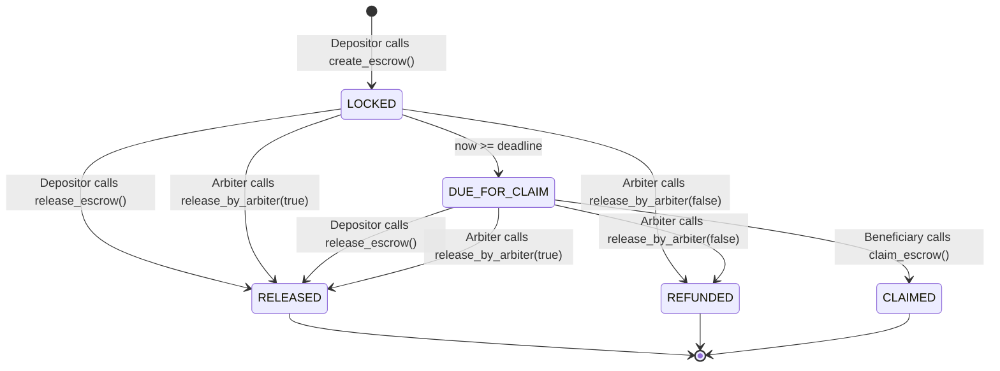

# On-Chain Escrow Management & Dispute Arbitration

## Overview

OphirPay provides on-chain escrow smart contracts deployed to Stellar Soroban. Escrows lock funds trustlessly until agreed-upon conditions are met, allowing early release by the depositor, self-service claim by the beneficiary upon reaching the deadline, or dispute resolution by an independent third-party arbiter.

The escrow mechanism enforces the critical `LOCKED_BALANCE` invariant (documented in `docs/SPEC.md` and audited in `docs/AUDIT.md`), guaranteeing that active user escrows cannot be withdrawn or drained by administrative actions.

---

## Smart Contract Architecture

The escrow implementation resides in `contracts/ophirpay/src/lib.rs`:

```rust
pub struct Escrow {
    pub id: u64,
    pub depositor: Address,
    pub beneficiary: Address,
    pub arbiter: Option<Address>,
    pub amount: i128,
    pub asset: Address,
    pub deadline: u64,
    pub released: bool,
    pub claimed: bool,
    pub metadata: String,
}
```

### Core Operations

| Function | Required Signature | Rules & Lifecycle Effects |
| :--- | :--- | :--- |
| `create_escrow` | `depositor.require_auth()` | Transfers `amount` from depositor to contract, increments `LOCKED_BALANCE`, and records escrow state. |
| `release_escrow` | `owner.require_auth()` | Depositor/owner can unlock funds early, immediately sending `amount` to beneficiary and marking `released = true, claimed = true`. |
| `claim_escrow` | `beneficiary.require_auth()` | Beneficiary can claim funds once `now >= deadline`, transferring `amount` to beneficiary and marking `claimed = true`. |
| `release_by_arbiter` | `arbiter.require_auth()` | Designated arbiter resolves disputes by releasing funds to beneficiary (`true`) or refunding to depositor (`false`). |
| `get_escrow` | Read-only simulation | Retrieves full on-chain escrow state and parameters. |
| `get_escrow_count`| Read-only simulation | Returns total count of escrows created. |

---

## Escrow State Machine



1. **LOCKED**: Funds are deposited and held securely in contract custody. The deadline has not yet passed.
2. **DUE_FOR_CLAIM**: The release deadline has passed. Beneficiary is authorized to self-claim the funds.
3. **RELEASED**: The depositor or arbiter released funds early to the beneficiary.
4. **REFUNDED**: The arbiter resolved a dispute in favor of the depositor, refunding locked tokens.
5. **CLAIMED**: The beneficiary claimed the tokens after deadline expiry.

---

## Role-Gated UI & Actions

### 1. Escrows Overview (`/escrows`)
- **Metrics Bar**: Summarizes Total Escrows, Active Locked Escrows, Total Locked Volume (XLM), and Claimable balance for the connected wallet.
- **Filter Tabs**: `All Escrows`, `As Depositor`, `As Beneficiary`, `As Arbiter`, `Active`, `Settled`.
- **Search**: Filters by Escrow ID, Depositor, Beneficiary, Arbiter, or Purpose Memo.
- **Creation Dialog**: `CreateEscrowModal` supports configuring beneficiary, optional arbiter, amount, deadline presets (1 Day, 3 Days, 1 Week, 30 Days) or custom days, and terms memo.

### 2. Escrow Card (`EscrowCard.tsx`)
- Visual status badges and active role indicators (`Depositor`, `Beneficiary`, `Arbiter`, `Observer`).
- Embedded `EscrowStateMachine` step visualizer.
- Live countdown timer updating every second until deadline.
- **Action Gating**:
  - **Depositor**: "Release Early to Beneficiary" button (disabled if settled).
  - **Beneficiary**: "Claim Escrow" button (disabled until deadline expires).
  - **Arbiter**: "Release to Beneficiary" and "Refund to Depositor" buttons (disabled if settled).
  - **Observer**: Read-only display.
- Surfaces contract errors directly in toast alerts and card banners.

### 3. Escrow Detail View (`/escrows/[id]`)
- Full-page inspection view with financial overview cards and deadline status.
- State machine indicator.
- Interactive action panel with context guidance for each role.
- Complete on-chain parameter table with Stellar explorer links.

---

## Verification & Testing

- **Unit Tests (`src/__tests__/escrow-state-machine.test.ts`)**:
  - Validates 4-state lifecycle progression (`LOCKED`, `DUE_FOR_CLAIM`, `RELEASED`, `CLAIMED`).
  - Validates role detection (`depositor`, `beneficiary`, `arbiter`, `observer`).
  - Tests normalization and stroop unit conversions.
- **Component & Action Tests (`src/__tests__/escrows-ui.test.tsx`)**:
  - Tests rendering of `EscrowStateMachine` and `EscrowCard`.
  - Tests Depositor early release invocation.
  - Tests Beneficiary deadline gating (disabled before deadline, enabled after).
  - Tests Arbiter release and refund actions.
  - Tests observer restrictions and on-chain error message surfacing.
- **End-to-End Suite (`e2e/escrows-flow.spec.ts`)**:
  - Exercises page navigation, metric cards, modal dialog form inputs, and `/escrows/1` detail view.
