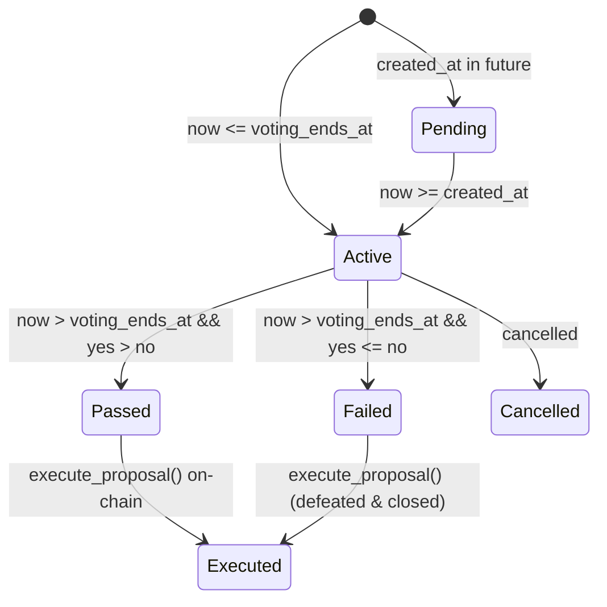

# Governance Proposal Detail View, Vote History & Execution State

This document outlines the architecture, explicit state machine, contract data reconciliation, vote history tracking, and condition-gated execution flow for Soroban governance proposals in OphirPay.

---

## 1. Overview & Problem

OphirPay implements on-chain governance using the Soroban smart contract (`configure_governance`, `create_proposal`, `vote_on_proposal`, `execute_proposal`, `get_proposal`).

Previously, governance was presented as an unstructured list without a dedicated detail route. Voters lacked access to:
- Who voted on the proposal and individual vote choices
- Live tally against the configured quorum and threshold (from `get_governance_config`)
- Proposal deposit and asset lock details
- The timing of voting and execution windows
- Condition-gated execution controls with contract error handling

This feature adds a full proposal detail route (`/governance/[id]`), backed by `/api/governance/proposals/[id]`, surfacing complete contract state, visual timeline stage indicators, and an explicit state machine.

---

## 2. Explicit State Machine

A proposal progresses through an explicit, deterministic state machine:



| State | Contract Condition | User Description | Actions Available |
|---|---|---|---|
| `pending` | `now < created_at` | Scheduled proposal awaiting voting start | View details |
| `active` | `now <= voting_ends_at && !executed` | Voting is currently open on-chain | Vote Yes / Vote No |
| `passed` | `now > voting_ends_at && !executed && yes > no` | Voting ended, majority threshold met | Execute Proposal |
| `failed` | `now > voting_ends_at && !executed && yes <= no` | Voting ended, defeated by majority | Closed (Execution ineligible) |
| `executed` | `executed: true` | Executed on-chain, deposit refunded | View completed proposal |
| `cancelled` | `cancelled: true` | Cancelled/withdrawn prior to execution | Inactive |

---

## 3. Tally, Quorum & Threshold

The detail view displays real-time voting data read directly from the Soroban contract:

- **Vote Tally**: `yes_votes` vs `no_votes` with a percentage progress bar.
- **Threshold**: Requires simple majority (`yes_votes > no_votes`) under the 1-address-1-vote model.
- **Quorum**: Configured in basis points via `get_governance_config` (e.g. `5100 bps = 51%`).
- **Timing Windows**:
  - **Voting Window**: From `created_at` to `voting_ends_at`, with live countdown (`Xd Yh remaining`).
  - **Execution Window**: Opens at `voting_ends_at` once voting has ended.

---

## 4. Condition-Gated Execution

The contract enforces strict execution rules in `execute_proposal()`:
1. `!proposal.executed` (reverts with `ProposalAlreadyExecuted` if already ran).
2. `now > proposal.voting_ends_at` (reverts with `VotingPeriodEnded` if voting is still open).
3. Contract is not paused.

The frontend guarantees that:
- The **Execute** button only renders when `canExecuteProposal()` returns true (`now > voting_ends_at && !executed && yes > no`).
- If an execution attempt is rejected on-chain (e.g., wallet rejection, contract revert), the error is intercepted and surfaced in an alert banner (`[role="alert"]`).

---

## 5. Vote History & 1-Address-1-Vote Model

Each address on Stellar is entitled to exactly 1 vote per proposal (enforced on-chain via `VOTE_KEY`).

The vote history component displays:
- Voter public key (with copy action and explorer link).
- Decision badge (`👍 Voted Yes` or `👎 Voted No`).
- Recorded timestamp and transaction hash.

---

## 6. API Reference

### `GET /api/governance/proposals/[id]`
Returns the full proposal detail, state machine outcome, quorum configuration, timing, and vote records.

**Sample Response**:
```json
{
  "success": true,
  "data": {
    "id": 42,
    "title": "Set Platform Fee Config",
    "description": "Adjust payment fee basis points to 15 bps",
    "action_type": "set_fee_config",
    "target": "configure_fees",
    "data": "0000000f",
    "yes_votes": 15,
    "no_votes": 2,
    "voting_ends_at": 1727180000,
    "executed": false,
    "created_at": 1726575200,
    "proposer": "GA5ZSEJYB37JRC5AVCIA5MOP4RHTM335X2KGX3IHOJAPP5RE34K4KZVN",
    "deposit_asset": "CDLZFC3SYJYDZT7K67VZ75HPJVIEUVNIXF47ZG2FB2RMQQVU2HHGCYSC",
    "deposit_amount": "50000000",
    "status": "passed",
    "canExecute": true,
    "quorum": {
      "targetBps": 5100,
      "targetPercentage": 51,
      "yesVotes": 15,
      "noVotes": 2,
      "totalVotes": 17,
      "thresholdMet": true
    },
    "votingTiming": {
      "isOpen": false,
      "remainingSeconds": 0,
      "formattedRemaining": "0s"
    },
    "executionTiming": {
      "isOpen": true,
      "executed": false
    },
    "votes": [
      {
        "proposalId": 42,
        "voter": "GBBD47IF6LWK7P7MDEVSCWR7DPUWV3NY3DTQEVFL4NAT4AQH3ZLLFLA5",
        "support": true,
        "timestamp": 1726576000,
        "txHash": "abc123"
      }
    ]
  }
}
```

---

## 7. Verification & Tests

- **Unit tests**: `src/__tests__/governance-proposal-detail.test.ts`
  - Tests state machine transitions (`pending`, `active`, `passed`, `failed`, `executed`, `cancelled`).
  - Tests execution eligibility rules.
  - Tests vote registry uniqueness.
  - Tests API route authentication, validation, 404 handling, and data mapping.
