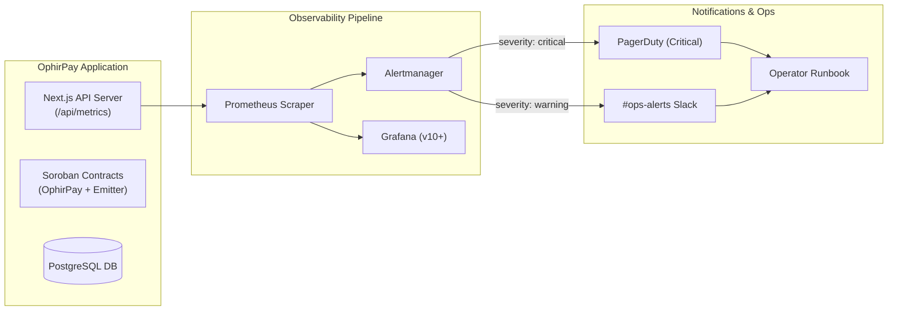

# 📈 Observability, Monitoring & Alert Runbook Guide

> Comprehensive operational guide for Prometheus metrics scraping, Grafana dashboard import, Alertmanager notification routing, and step-by-step incident response runbooks for all OphirPay alerts.

---

## 1. Overview & Architecture

OphirPay exports Prometheus-compatible telemetry for tracking API health, database pool saturation, batch processing, webhook delivery reliability, and Soroban smart contract solvency invariants.



---

## 2. Metrics Endpoint & Scrape Configuration

OphirPay exposes metrics at `/api/metrics` using the standard Prometheus text exposition format.

### 2.1 Authentication & Security Requirements

`/api/metrics` exposes sensitive internal diagnostics including process memory, database pool status, error rates, and live SSE connections. Therefore, **access is restricted and fails closed (`401 Unauthorized`)**.

Every scrape request must provide an authorization credential via one of two methods:

| Method | Header | Description |
|---|---|---|
| **Scrape Token (Preferred)** | `Authorization: Bearer <METRICS_TOKEN>` | Evaluated in constant time against the `METRICS_TOKEN` environment variable. |
| **Admin API Key** | `Authorization: Bearer <API_KEY>` or `X-API-Key: <API_KEY>` | Valid API key carrying the `admin` scope. |

> [!WARNING]
> If `METRICS_TOKEN` is unset in the environment and no valid admin API key is supplied, `/api/metrics` immediately rejects all requests with `401 Unauthorized` without returning any metric body.

---

### 2.2 Prometheus Scrape Configuration (`prometheus.yml`)

Add the following scrape job configuration to your `prometheus.yml`:

```yaml
scrape_configs:
  - job_name: "ophirpay"
    scrape_interval: 15s
    scrape_timeout: 10s
    metrics_path: "/api/metrics"
    scheme: "https"
    authorization:
      type: "Bearer"
      credentials: "${METRICS_TOKEN}" # Or hardcode secret from secrets manager
    static_configs:
      - targets: ["api.ophirpay.com"]
        labels:
          environment: "production"
          service: "ophirpay-api"
```

To verify the scrape manually from the terminal:
```bash
curl -sS -H "Authorization: Bearer $METRICS_TOKEN" https://api.ophirpay.com/api/metrics | head -n 30
```

---

## 3. Grafana Dashboard Import & Setup

The repository ships a pre-configured dashboard at `monitoring/grafana-dashboard.json`.

### 3.1 Supported Grafana Versions
* **Supported Versions:** Grafana **10.x** and **11.x** (dashboard `schemaVersion: 39`).
* **Backward Compatibility:** Compatible with Grafana **9.5+**.
* **Required Datasource:** A Prometheus datasource configured with UID `prometheus`.

### 3.2 Step-by-Step UI Import
1. Log into your Grafana web interface.
2. In the left navigation menu, navigate to **Dashboards** → **New** → **Import** (or visit `/dashboard/import`).
3. Click **Upload dashboard JSON file** and select `monitoring/grafana-dashboard.json` (or paste the file contents directly into the text box).
4. In the **Prometheus** dropdown, select your Prometheus datasource.
5. Click **Import**. The dashboard **"OphirPay — Payment Infrastructure"** will load immediately.

### 3.3 Automated Provisioning via File
For Kubernetes or containerized deployments, mount `monitoring/grafana-dashboard.json` into `/var/lib/grafana/dashboards/` and configure a dashboard provider in `/etc/grafana/provisioning/dashboards/ophirpay.yaml`:

```yaml
apiVersion: 1
providers:
  - name: "OphirPay"
    orgId: 1
    folder: "Payment Infrastructure"
    type: file
    disableDeletion: false
    updateIntervalSeconds: 30
    options:
      path: /var/lib/grafana/dashboards/grafana-dashboard.json
```

---

## 4. Alertmanager Routing Configuration

The alert rules in `monitoring/prometheus-alerts.yml` are designed to route notifications according to alert severity.

### 4.1 Prometheus Alert Rule Registration
In `prometheus.yml`, reference the rule file:

```yaml
rule_files:
  - "/etc/prometheus/prometheus-alerts.yml"

alerting:
  alertmanagers:
    - static_configs:
        - targets: ["alertmanager:9093"]
```

### 4.2 Example `alertmanager.yml` Routing Configuration

```yaml
global:
  resolve_timeout: 5m

route:
  group_by: ["alertname", "cluster", "service"]
  group_wait: 30s
  group_interval: 5m
  repeat_interval: 4h
  receiver: "slack-warnings"
  routes:
    # Route all critical alerts to PagerDuty and high-priority Slack
    - match:
        severity: critical
      receiver: "pagerduty-critical"
      continue: true
    - match:
        severity: critical
      receiver: "slack-critical"

receivers:
  - name: "pagerduty-critical"
    pagerduty_configs:
      - service_key: "${PAGERDUTY_KEY}"
        severity: "critical"
        send_resolved: true

  - name: "slack-critical"
    slack_configs:
      - channel: "#ops-critical"
        api_url: "${SLACK_WEBHOOK_URL}"
        send_resolved: true
        title: "[CRITICAL] {{ .GroupLabels.alertname }}"
        text: "{{ range .Alerts }}{{ .Annotations.description }}\n{{ end }}"

  - name: "slack-warnings"
    slack_configs:
      - channel: "#ops-alerts"
        api_url: "${SLACK_WEBHOOK_URL}"
        send_resolved: true
        title: "[WARNING] {{ .GroupLabels.alertname }}"
        text: "{{ range .Alerts }}{{ .Annotations.description }}\n{{ end }}"
```

---

## 5. First-Response Alert Runbooks

This section provides the exact first-response triage, mitigation, and escalation procedures for every alert defined in `monitoring/prometheus-alerts.yml`.

---

### Alert 1: `ContractBalanceBelowLocked`
* **Severity:** 🔴 **Critical**
* **Trigger:** `ophirpay_contract_balance - ophirpay_locked_balance < 0` for 1m
* **What it means:** The smart contract's actual token balance has fallen below the total sum of funds committed to active escrows and unvested streams. This represents a critical solvency failure, accounting invariant violation, or potential exploit.

#### Immediate Action — Emergency Contract Pause:
Execute an emergency pause immediately to prevent any further withdrawals:
1. **Via Admin Web Interface:**
   - Navigate to `/pause-controls`.
   - Click **Emergency Global Pause (OphirPay + Emitter)** and sign the transaction with the Contract Owner wallet.
2. **Via Soroban CLI (Terminal):**
   ```bash
   stellar contract invoke \
     --id "$NEXT_PUBLIC_CONTRACT_ID" \
     --source-account "$ADMIN_SECRET_KEY" \
     --network testnet \
     -- emergency_pause_all \
     --caller "$ADMIN_STELLAR_ADDRESS"
   ```
* **Blast Radius:** Pausing disables all mutating write functions (`record_payment`, `create_batch`, `create_escrow`, `create_stream`, `claim_stream`, `process_refund`). All read queries (`get_payment`, `get_stream`, `is_paused`) remain functional.
* **Escalation:** Page the Lead Security Engineer and Soroban Smart Contract author immediately. Export contract storage snapshot.

---

### Alert 2: `ContractBalanceDroppingFast`
* **Severity:** 🟡 **Warning**
* **Trigger:** `rate(ophirpay_contract_balance[5m]) < -10000000000` for 5m
* **What it means:** The contract balance is decreasing at an unusually high rate (>1,000 XLM/s equivalent).
* **First Actions:**
  1. Inspect the `/api/audit-log` or `/audit-log` dashboard to identify recent stream claims or batch completions.
  2. Verify whether high volume is expected (e.g. scheduled monthly corporate payroll batch).
  3. If uncoordinated or originating from unauthorized accounts, consider triggering a scoped pause on streams/escrows.

---

### Alert 3: `LockedBalanceDivergence`
* **Severity:** 🟡 **Warning**
* **Trigger:** `abs(ophirpay_contract_balance - ophirpay_locked_balance - ophirpay_unlocked_balance) > 10000000` for 5m
* **What it means:** Accounting discrepancy between total contract balance and the sum of tracked locked + unlocked balances.
* **First Actions:**
  1. Check recent contract upgrade transactions or migrations.
  2. Compare off-chain database balances against Soroban instance storage entries (`LOCKED_BAL`, `FEE_POOL`).
  3. Run contract audit verification tests locally.

---

### Alert 4: `BatchPaymentFailureRateHigh`
* **Severity:** 🔴 **Critical**
* **Trigger:** Batch item failure rate `> 50%` for 10m
* **What it means:** Over half of individual payments within submitted batches are failing.
* **First Actions:**
  1. Check Stellar Horizon and RPC connectivity (`NEXT_PUBLIC_STELLAR_RPC_URL`).
  2. Verify source account sequence numbers and XLM reserve requirements.
  3. Inspect `/api/payments` error logs: check if destination accounts lack required asset trustlines (`AssetNotSupported` or `op_no_trust`).
  4. Notify batch submitters and pause batch scheduler if RPC node is desynced.

---

### Alert 5: `PaymentProcessingLatencyHigh`
* **Severity:** 🟡 **Warning**
* **Trigger:** P95 payment processing duration `> 30s` for 5m
* **What it means:** End-to-end payment creation, signing, or Horizon confirmation is experiencing extreme latency.
* **First Actions:**
  1. Check Stellar network congestion and ledger close times via Horizon `/fee_stats`.
  2. Inspect database query latency metrics (`ophirpay_db_query_duration_seconds`).
  3. Check Horizon RPC failover status (see `/api/health`).

---

### Alert 6: `WebhookDeliveryFailureRateHigh`
* **Severity:** 🟡 **Warning**
* **Trigger:** Webhook final delivery failure rate `> 25%` for 10m
* **What it means:** Over a quarter of outgoing webhook dispatches are exhausting retry limits and failing permanently.
* **First Actions:**
  1. Query dead-letter queue `/api/webhooks` or database `WebhookDelivery` status `FAILED`.
  2. Verify if a specific subscriber endpoint is returning 5xx or timing out (SSRF guard or subscriber outage).
  3. Inspect worker outbound egress connectivity.

---

### Alert 7: `WebhookQueueDepthHigh`
* **Severity:** 🟡 **Warning**
* **Trigger:** `ophirpay_webhook_queue_depth > 1000` for 5m
* **What it means:** Over 1,000 webhook events are queued awaiting dispatch; delivery worker is backed up.
* **First Actions:**
  1. Check webhook worker thread / pod health.
  2. Scale up webhook worker replicas in Kubernetes (`kubectl scale deployment ophirpay-webhook --replicas=3`).
  3. Verify Redis connection if BullMQ or queue broker is in use.

---

### Alert 8: `ApiHighErrorRate`
* **Severity:** 🔴 **Critical**
* **Trigger:** HTTP 5xx error rate `> 5%` for 5m
* **What it means:** An active outage is impacting API clients and frontend users.
* **First Actions:**
  1. Inspect container logs: `kubectl logs -l app=ophirpay --tail=100`.
  2. Check for unhandled exceptions or failing external dependencies (database, Redis, RPC).
  3. Review `/api/health` status.

---

### Alert 9: `ApiDown`
* **Severity:** 🔴 **Critical**
* **Trigger:** `up{job="ophirpay"} == 0` for 2m
* **What it means:** The API server instance is completely unresponsive to Prometheus scrape requests and health probes.
* **First Actions:**
  1. Check pod status: `kubectl get pods -l app=ophirpay`.
  2. Inspect crash logs or OOMKilled events: `kubectl describe pod -l app=ophirpay`.
  3. Check load balancer and ingress status. Restart unhealthy containers.

---

### Alert 10: `DatabaseConnectionPoolExhausted`
* **Severity:** 🔴 **Critical**
* **Trigger:** `ophirpay_db_pool_available < 2` for 2m
* **What it means:** The database connection pool is nearly saturated; incoming queries will block or throw `P2024` connection timeout errors.
* **First Actions:**
  1. Inspect active PostgreSQL connections:
     ```sql
     SELECT count(*), state FROM pg_stat_activity GROUP BY state;
     ```
  2. Check for leaking unclosed `prisma.$transaction` calls.
  3. If traffic has genuinely scaled, adjust pool settings or increase PgBouncer pool limits.

---

### Alert 11: `DatabaseQueryLatencyHigh`
* **Severity:** 🟡 **Warning**
* **Trigger:** P95 database query latency `> 1s` for 5m
* **What it means:** Database queries are running slowly, degrading application response times.
* **First Actions:**
  1. Check PostgreSQL `pg_stat_statements` for long-running table scans.
  2. Check if high-volume tables (`Payment`, `AuditLog`, `WebhookEvent`) are missing required indexes.
  3. Check PostgreSQL CPU and memory utilization.

---

### Alert 12: `RateLimitHitsHigh`
* **Severity:** 🟡 **Warning**
* **Trigger:** Rate limit rejections `> 10/s` for 5m
* **What it means:** Heavy traffic is triggering IP or API key rate limit thresholds.
* **First Actions:**
  1. Check `/api/metrics` rate limit metrics by IP / key prefix.
  2. Determine if this is an active denial-of-service attempt or a misconfigured customer script.
  3. If legitimate partner traffic, issue a higher-tier API key or adjust rate-limiting limits in `src/lib/rate-limit.ts`.
