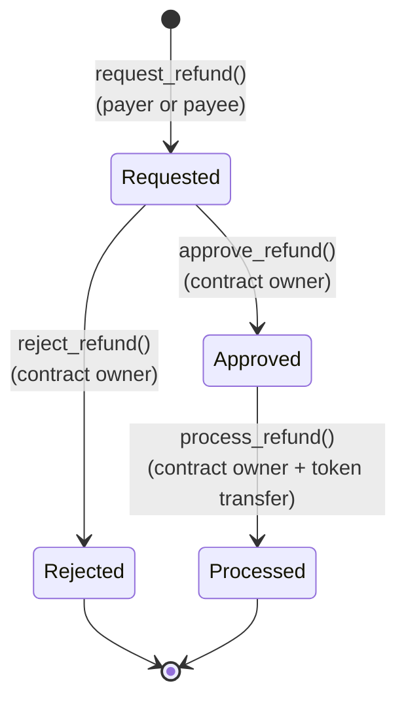

# 💸 Refund System, Reason Codes & Analytics Guide

> Comprehensive architectural guide to the OphirPay refund lifecycle, on-chain Soroban contract authorization rules, reason-code catalog, and bounded analytics aggregation.

---

## 1. Overview & Architecture

OphirPay provides an end-to-end refund orchestration subsystem combining:
1. **On-Chain Soroban Smart Contract (`contracts/ophirpay/src/lib.rs`)**: Holds escrowed / payment assets, enforces fund-safety invariants, tracks on-chain lifecycle transitions, and aggregates reason-code metrics.
2. **Off-Chain Database & Audit Ledger (`prisma/schema.prisma`)**: Tracks database records (`Refund`), links on-chain transaction outcomes via `onChainId`, prevents duplicate submissions (idempotency), and records immutable audit log rows (`AuditLog`).
3. **Application API Routes (`src/app/api/refunds/`)**: Authenticated endpoints allowing clients to query refund history, submit refund requests, update lifecycle status, and retrieve reason-code analytics.

---

## 2. Refund Lifecycle & State Machine

Refunds progress through a deterministic four-stage lifecycle on-chain and in the database:



### State Definitions

| State | Contract Enum (`RefundStatus`) | DB Enum (`RefundStatus`) | Description |
|---|---|---|---|
| **`REQUESTED`** | `RefundStatus::Requested` | `REQUESTED` | Refund request submitted on-chain by the payer or payee with amount, asset, reason string, and reason code. Awaiting review. |
| **`APPROVED`** | `RefundStatus::Approved` | `APPROVED` | Approved by the contract owner. Funds remain locked in contract until disbursement. |
| **`REJECTED`** | `RefundStatus::Rejected` | `REJECTED` | Rejected by the contract owner. No funds are disbursed; lifecycle terminal. |
| **`PROCESSED`** | `RefundStatus::Processed` | `PROCESSED` | Contract disburses tokens back to the requester via Soroban token transfer; lifecycle terminal. |

---

## 3. Authorization & Fund-Safety Rules (Per Transition)

The refund system implements strict authorization checks and reentrancy protections:

### 3.1 `request_refund`
Requests a refund for a previously recorded payment.

* **Callable by:** Either the **payer** OR the **payee** of the referenced payment (`requester == payment.payer || requester == payment.payee`).
* **Authentication:** Requires `requester.require_auth()`.
* **Validation Rules:**
  * **Not Paused:** Contract must not be paused (`require_not_paused(&env)`).
  * **Non-Zero Amount:** `amount > 0` (violating returns `PaymentError::InvalidAmount`).
  * **Payment Exists & Not Cancelled:** `payment_id` must exist and `!payment.cancelled` (violating returns `PaymentAlreadyCancelled`).
  * **Payer/Payee Check (HIGH-1 Audit Fix):** Requester must match `payment.payer` or `payment.payee`. Third parties or unauthorized callers are rejected with `PaymentError::Unauthorized`.
  * **Partial vs Full Bounds:** `amount <= payment.amount`. Partial refunds (`amount < payment.amount`) and full refunds (`amount == payment.amount`) are both supported. Exceeding the payment amount returns `PaymentError::InvalidAmount`.
  * **Asset Match:** `asset == payment.asset` (violating returns `PaymentError::AssetNotSupported`).
* **Events & Audit:** Emits `("refund", "requested")` event and writes on-chain audit entry `refund_requested`.

### 3.2 `approve_refund`
Moves a pending refund from `REQUESTED` to `APPROVED`.

* **Callable by:** **Contract Owner only** (`require_owner(&env, &caller)`).
* **Authentication:** Requires `caller.require_auth()`.
* **Validation Rules:**
  * **Not Paused:** Contract must not be paused.
  * **Prior Status:** Refund must exist and be in `RefundStatus::Requested`. Already approved, rejected, or processed refunds fail with `PaymentError::RefundAlreadyProcessed`.
* **Audit:** Writes on-chain audit entry `refund_approved` with `resolved_at = env.ledger().timestamp()`.

### 3.3 `reject_refund`
Rejects a pending refund.

* **Callable by:** **Contract Owner only** (`require_owner(&env, &caller)`).
* **Authentication:** Requires `caller.require_auth()`.
* **Validation Rules:**
  * **Not Paused:** Contract must not be paused.
  * **Prior Status:** Refund must exist and be in `RefundStatus::Requested`. Already resolved refunds fail with `PaymentError::RefundAlreadyProcessed`.
* **Audit:** Writes on-chain audit entry `refund_rejected` with `resolved_at = env.ledger().timestamp()`.

### 3.4 `process_refund`
Disburses funds back to the requester for an approved refund.

* **Callable by:** **Contract Owner only** (`require_owner(&env, &caller)`).
* **Authentication:** Requires `caller.require_auth()`.
* **Security & Execution:**
  * **Reentrancy Lock (MEDIUM-4 Audit Fix):** Acquires contract reentrancy guard (`acquire_reentrancy_lock(&env)`) before any token transfer.
  * **Not Paused:** Contract must not be paused.
  * **Prior Status:** Refund must exist and be in `RefundStatus::Approved`. If in `Requested`, `Rejected`, or `Processed`, fails with `PaymentError::RefundAlreadyProcessed`.
  * **Token Disbursement:** Calls `token::Client::transfer(&contract_addr, &refund.requester, &refund.amount)`.
* **Events & Audit:** Emits `("refund", "processed")` event and writes on-chain audit entry `refund_processed`.

---

## 4. Refund Reason-Code Catalog

The contract defines a typed 6-variant enum `RefundReasonCode` (`contracts/ophirpay/src/lib.rs`), mapped to integer codes `0` through `5`:

| Code | Variant | Human Label | Semantic Definition & Typical Use Case | Valid Refund Scope |
| :---: | :--- | :--- | :--- | :--- |
| **`0`** | `ProductDefect` | Product Defect / Service Quality | The delivered product, digital asset, or service was defective, corrupted, or failed to meet agreed contractual specifications. | Full or Partial |
| **`1`** | `NonDelivery` | Non-Delivery of Goods / Services | The payer fulfilled payment but the promised goods, license, or service was never delivered or fulfilled by the payee. | Full only (unless multi-item batch) |
| **`2`** | `DuplicateCharge` | Duplicate Payment / Double Billing | The customer was debited more than once for the same invoice, purchase, or subscription cycle due to client retry or operator error. | Full |
| **`3`** | `Unauthorized` | Unauthorized / Fraudulent Transaction | Transaction was initiated without the account owner's consent, or compromised credentials were used. | Full |
| **`4`** | `CustomerRequest` | Voluntary Customer Cancellation | The buyer requested a return, cancellation, or order modification within the allowable merchant return window. | Full or Partial |
| **`5`** | `Other` | Other / Custom Business Reason | Unclassified reason. A detailed description explaining the circumstances must be supplied in the free-text `reason` field. | Full or Partial |

---

## 5. Analytics Aggregation & Bounded Scan Window

OphirPay provides aggregated metrics on refund reasons for compliance, fraud monitoring, and dispute analysis.

### 5.1 On-Chain Analytics: `get_reason_code_analytics()`
* **Entrypoint:** `pub fn get_reason_code_analytics(env: Env) -> Vec<(u32, u64)>`
* **Access:** Public read (available to all users, auditors, and monitoring tools).
* **Output:** A vector of `(reason_code, count)` pairs covering codes `0` through `5`.

#### Bounded Window & Truncation Semantics (MEDIUM-2 Audit Fix):
To prevent unbounded iteration, gas exhaustion, and transaction timeout as the total number of refunds grows over the contract's lifetime:
* The contract fetches total refunds `total = REFUND_CNT`.
* The scan window is explicitly capped at the **most recent 100 refunds**:
  ```rust
  let start = total.saturating_sub(99); // last 100 (1-based IDs)
  for id in start..=total {
      // aggregate reason codes
  }
  ```
* **Truncation Behavior:** When total refunds exceed 100, historical refunds prior to `id = total - 99` are **not included** in the on-chain return value. This guarantees deterministic O(1) gas cost and sub-second execution on Stellar Soroban nodes.

---

### 5.2 Application API Endpoint: `GET /api/refunds?analytics=true`
* **Route:** `GET /api/refunds?analytics=true`
* **Authentication:** Authenticated session required (wallet cookie or API key).
* **Behavior:** Queries the PostgreSQL database for all refund records owned by `auth.userId` and aggregates counts across all reason codes:
  ```json
  [
    { "code": 0, "count": 2 },
    { "code": 1, "count": 0 },
    { "code": 2, "count": 1 },
    { "code": 3, "count": 0 },
    { "code": 4, "count": 5 },
    { "code": 5, "count": 1 }
  ]
  ```

---

## 6. Application API Endpoints Reference

### 1. List Refunds
* `GET /api/refunds`
* Returns the most recent 50 refunds for the authenticated user, ordered by `requestedAt DESC`.

### 2. Get Reason Analytics
* `GET /api/refunds?analytics=true`
* Returns grouped reason-code count buckets (`code` 0–5).

### 3. Create Refund Record
* `POST /api/refunds`
* Persists an off-chain record after on-chain `request_refund` completes.
* **Idempotency:** Enforces unique `(userId, paymentId)` — duplicate attempts return `409 Conflict`.

### 4. Update Refund Status
* `PATCH /api/refunds/[id]`
* Updates status to `APPROVED`, `REJECTED`, or `PROCESSED` and logs an entry to `AuditLog`.
