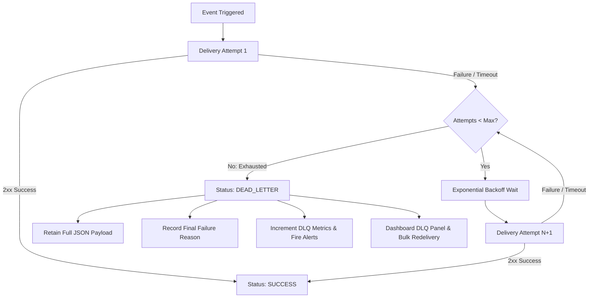

# Webhook Dead-Letter Queue & Delivery Timeout

## Overview

OphirPay delivers payment and account lifecycle events via signed HTTP webhooks with exponential backoff retries. When a subscriber's receiver hangs or repeatedly returns non-2xx statuses, delivery attempts can exhaust their retry budget.

Prior to this subsystem, exhausted deliveries were marked simply as `FAILED` and their payloads were difficult to inspect or reprocess without manual database intervention. Furthermore, unconstrained socket timeouts could block worker threads on hanging endpoints.

This document outlines the **Dead-Letter Queue (DLQ)** and **bounded delivery timeout** architecture in OphirPay.

---

## 1. Bounded Per-Attempt Timeout

Every outgoing webhook delivery attempt enforces a strict, bounded per-attempt timeout:
- **Default Timeout:** `5,000ms` (`DEFAULT_WEBHOOK_TIMEOUT_MS`).
- **Cancellation Mechanism:** Managed via standard `AbortSignal.timeout(timeoutMs)`.
- **Distinct Failure Classification:**
  - If the receiver does not complete HTTP headers and response body within the allotted window, the attempt is aborted and recorded with a distinct error message:
    ```
    TIMEOUT: Delivery attempt timed out after 5000ms
    ```
  - This distinguishes hanging endpoints and connection timeouts from explicit HTTP errors (such as `HTTP 500` or `HTTP 503`).
- **Metric Increment:** Timeouts immediately increment the Prometheus counter `ophirpay_webhooks_timeout_total`.

---

## 2. Dead-Letter State Lifecycle

### Retry Budget
Deliveries are retried up to `DEFAULT_WEBHOOK_MAX_ATTEMPTS` (3 attempts) with exponential backoff (1s, 2s, 4s).



### Transition to Dead-Letter State
When an event exhausts its final retry attempt without success:
1. **Status Transition:** The delivery record's status is set to `DEAD_LETTER` (persisted in Postgres via Prisma enum `DeliveryStatus.DEAD_LETTER`).
2. **Payload Retention:** The original `WebhookEvent.data` JSON payload is permanently preserved alongside the delivery record.
3. **Failure Reason Recording:** The `errorMessage` field captures the final attempt's reason (e.g., `TIMEOUT: Delivery attempt timed out after 5000ms`, `HTTP 502 Bad Gateway`).
4. **Metric Recording:** 
   - `webhooks_dead_letter_total` is incremented.
   - `delivery_final_outcomes` is recorded with `final_outcome: "dead_letter"` and `attempt_number: 3`.

---

## 3. Querying the Dead-Letter Queue

### `GET /api/webhooks/[id]/dead-letter`
Retrieves all deliveries currently in the `DEAD_LETTER` state for a webhook endpoint owned by the authenticated user.

#### Query Parameters
- `limit` *(optional, integer, default: 50, max: 100)*: Maximum number of dead-letter records to return.

#### Example Response
```json
{
  "data": [
    {
      "id": "cm1abcdef0001",
      "eventId": "evt_01920394",
      "eventType": "payment.completed",
      "eventTimestamp": "2026-09-24T10:00:00.000Z",
      "payload": {
        "paymentId": "pay_987654321",
        "amount": "120.00",
        "assetCode": "USDC",
        "status": "COMPLETED"
      },
      "status": "DEAD_LETTER",
      "responseCode": null,
      "latencyMs": 5004,
      "attempts": 3,
      "errorMessage": "TIMEOUT: Delivery attempt timed out after 5000ms",
      "isReplay": false,
      "replayBatchId": null,
      "deliveredAt": "2026-09-24T10:00:08.000Z"
    }
  ],
  "meta": {
    "total": 1,
    "limit": 50
  }
}
```

---

## 4. Bulk & Single Redelivery with Audit Trail

Once a subscriber resolves endpoint downtime or fixes configuration bugs, they can redeliver dead-lettered events without losing order or history.

### `POST /api/webhooks/[id]/dead-letter/redeliver`

#### Request Body
- Optional. To redeliver specific events, supply:
  ```json
  {
    "deliveryIds": ["cm1abcdef0001"]
  }
  ```
- If the body is omitted or `{}` is passed, **all** current dead-letter deliveries for the webhook (up to 50 per batch) are redelivered.

#### Security & Audit Logging
1. Requires authentication and CSRF token (`x-csrf-token`).
2. Generates a unique replay batch identifier: `dlq_batch_<hex>`.
3. Every invocation writes an immutable record to `AuditLog`:
   - `action`: `"webhook:dead-letter:bulk-redeliver"`
   - `actor`: User ID of operator
   - `target`: Webhook ID
   - `details`:
     ```json
     {
       "replayBatchId": "dlq_batch_9a8b7c6d5e4f3a2b",
       "total": 4,
       "succeeded": 4,
       "failed": 0,
       "priorDeliveryIds": ["del_1", "del_2", "del_3", "del_4"]
     }
     ```

#### Response Example
```json
{
  "data": {
    "message": "Bulk redelivery completed: 4 succeeded, 0 failed",
    "total": 4,
    "succeeded": 4,
    "failed": 0,
    "replayBatchId": "dlq_batch_9a8b7c6d5e4f3a2b",
    "results": [
      {
        "priorDeliveryId": "del_1",
        "newDeliveryId": "del_replay_99",
        "success": true,
        "statusCode": 200
      }
    ]
  }
}
```

---

## 5. Metrics & Prometheus Alerting

### Prometheus Metrics
Exposed at `GET /api/metrics`:

| Metric Name | Type | Description |
|---|---|---|
| `ophirpay_webhooks_dead_letter_total` | Counter | Total webhook events that exhausted retries and landed in DLQ |
| `ophirpay_webhooks_timeout_total` | Counter | Total webhook delivery attempts that exceeded per-attempt timeout |
| `ophirpay_delivery_attempts_total` | Counter | Total delivery attempts labelled by `delivery_type` and `attempt_number` |
| `ophirpay_delivery_final_outcomes_total` | Counter | Terminal outcomes labelled by `final_outcome="dead_letter\|success\|failure"` |

### Prometheus Alert Rules
Defined in `monitoring/prometheus-alerts.yml`:

```yaml
- alert: WebhookDeadLetterQueueThresholdExceeded
  expr: rate(ophirpay_webhooks_dead_letter_total[10m]) > 0.05
  for: 5m
  labels:
    severity: warning
    component: webhooks
  annotations:
    summary: "Webhook events exhausting retries into dead-letter queue"
    description: "Webhook deliveries are persistently exhausting retries into DLQ. Check subscriber health."

- alert: WebhookDeliveryTimeoutRateHigh
  expr: rate(ophirpay_webhooks_timeout_total[10m]) > 0.10
  for: 5m
  labels:
    severity: warning
    component: webhooks
  annotations:
    summary: "Webhook delivery timeout rate high"
    description: "Webhook delivery attempts are exceeding the per-attempt bounded timeout (5000ms)."
```

---

## 6. Dashboard Interface (`/webhooks/[id]`)

The webhook management console provides a dedicated panel featuring:
1. **Live Counters:** Delivered, Failed, Dead-Letter Queue, and Timeouts.
2. **Attempt Distribution:** Visual breakdown of counts across attempts 1, 2, and 3.
3. **Outcome Distribution:** Breakdown of terminal success, failure, and dead-letter states.
4. **Dead-Letter Queue Table:**
   - Status badge and attempt exhaustion count (`Attempts: 3/3`).
   - Highlighted failure reason (differentiating `TIMEOUT:` from HTTP error codes).
   - Expandable retained payload drawer with syntax formatting and one-click copy.
   - Individual "Redeliver" and "Bulk Redeliver All" actions with real-time toast feedback.
