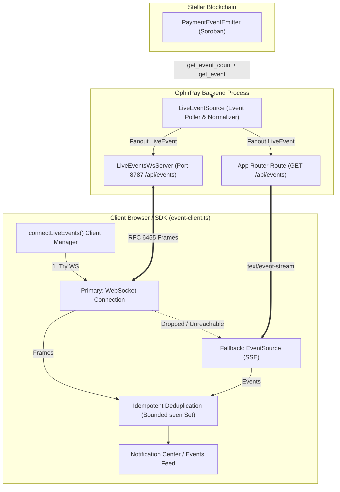
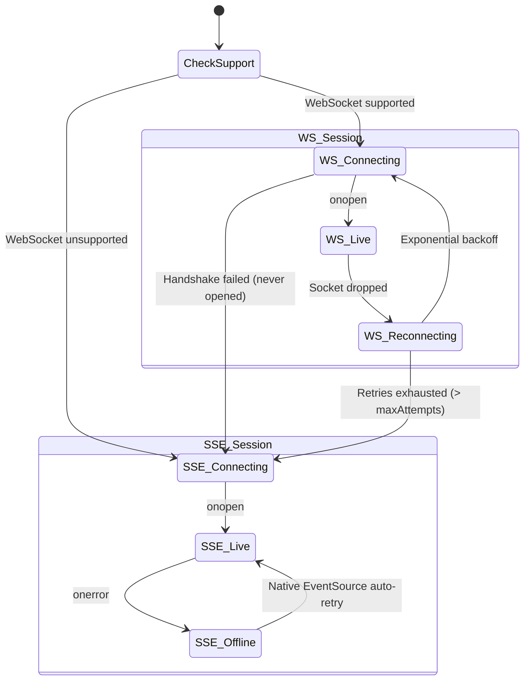

# 🔌 OphirPay WebSocket Live-Event Server

> Comprehensive reference for the OphirPay real-time WebSocket live-event server, protocol specification, message schemas, transport fallback contract relative to SSE, configuration, and deployment architecture.

---

## 1. Overview & Dual-Transport Architecture

OphirPay delivers real-time on-chain payment notifications and lifecycle events using a **dual-transport architecture**:

1. **WebSocket Transport (Preferred):** A persistent, low-latency, bidirectional RFC 6455 socket server listening on port `8787` (`/api/events`). It eliminates HTTP header overhead and provides instant event push.
2. **Server-Sent Events (SSE Fallback):** An HTTP streaming route at `GET /api/events` served directly by Next.js App Router route handlers.

Both transports subscribe to the identical in-process `createLiveEventSource` (`src/lib/events/event-source.ts`), which polls the deployed `PaymentEventEmitter` Soroban smart contract on Stellar. Clients automatically negotiate the best available transport: they prefer WebSocket, but seamlessly fall back to SSE when running in restrictive networks or serverless deployments.



---

## 2. Server Implementation & Lifecycle

The WebSocket server is implemented in [`src/lib/events/live-events-ws-server.ts`](../src/lib/events/live-events-ws-server.ts) and backed by the custom protocol utilities in [`src/lib/events/ws-protocol.ts`](../src/lib/events/ws-protocol.ts).

### Server Startup & Next.js Instrumentation

Next.js App Router route handlers are strictly HTTP request-response handlers. Because WebSockets require a persistent Node.js TCP socket, the WebSocket server runs as an in-process HTTP/TCP server started by Next.js **instrumentation hook** ([`src/instrumentation.ts`](../src/instrumentation.ts)):

```typescript
// src/instrumentation.ts
export async function register() {
  if (
    process.env.NEXT_RUNTIME === "nodejs" &&
    process.env.NEXT_PHASE !== "phase-production-build"
  ) {
    const { bootstrap } = await import("@/lib/startup");
    await bootstrap();

    try {
      const { startLiveEventsWsServer } = await import(
        "@/lib/events/live-events-ws-server"
      );
      const wsServer = await startLiveEventsWsServer();
      wsServer.startEventStream();
      console.info(
        `[OphirPay] WebSocket event server listening on port ${wsServer.port}`
      );
    } catch (error) {
      console.warn(
        "[OphirPay] WebSocket event server unavailable — clients will use SSE:",
        error instanceof Error ? error.message : String(error)
      );
    }
  }
}
```

### Key Lifecycle Guarantees:
* **Zero Startup Crashes:** Startup errors (such as port conflicts or serverless environment constraints) are caught gracefully. The server logs a warning and the application continues to serve web pages and SSE endpoints without interruption.
* **Build-Phase Isolation:** The server never boots during `npm run build` (`phase-production-build`).
* **Clean Shutdown:** When `close()` is called, active clients receive an RFC 6455 `CLOSE` control frame (`0x8`), all sockets are destroyed, the shared event poller is halted, and keepalive heartbeat timers are cleared.

---

## 3. Protocol Specification (RFC 6455)

The implementation in `ws-protocol.ts` is a lightweight, zero-dependency, fully compliant subset of **RFC 6455**.

### Handshake & Accept Key Computation

When a client initiates an upgrade:

1. **Client Request:**
   ```http
   GET /api/events HTTP/1.1
   Host: localhost:8787
   Upgrade: websocket
   Connection: Upgrade
   Sec-WebSocket-Key: dGhlIHNhbXBsZSBub25jZQ==
   Sec-WebSocket-Version: 13
   ```
2. **Server Computation:**
   The server concatenates the client's `Sec-WebSocket-Key` with the RFC 6455 magic GUID `258EAFA5-E914-47DA-95CA-C5AB0DC85B11`, calculates the SHA-1 digest, and encodes it in Base64:
   ```typescript
   export function computeAcceptKey(secWebSocketKey: string): string {
     return createHash("sha1")
       .update(secWebSocketKey + "258EAFA5-E914-47DA-95CA-C5AB0DC85B11")
       .digest("base64");
   }
   ```
3. **Server Response:**
   ```http
   HTTP/1.1 101 Switching Protocols
   Upgrade: websocket
   Connection: Upgrade
   Sec-WebSocket-Accept: s3pPLMBiTxaQ9kYGzzhZRbK+xOo=
   ```

### Path Validation & Plain HTTP Rejection

* **Path Enforcement:** The server only accepts connections to its designated path (default `/api/events`). Any upgrade request on another path is rejected immediately by destroying the socket (`socket.destroy()`).
* **HTTP 426 Upgrade Required:** If a client or scanner sends a standard HTTP `GET` request without WebSocket upgrade headers, the server responds with HTTP 426:
  ```json
  {
    "error": {
      "code": "UPGRADE_REQUIRED",
      "message": "This endpoint only accepts WebSocket connections."
    }
  }
  ```

### Supported RFC 6455 Opcodes

| Opcode | Constant | Description | Direction |
|---|---|---|---|
| `0x0` | `OPCODE_CONTINUATION` | Fragmented frame payload | Client → Server |
| `0x1` | `OPCODE_TEXT` | UTF-8 encoded JSON payload | Server → Client / Client → Server |
| `0x8` | `OPCODE_CLOSE` | Connection termination handshake | Bidirectional |
| `0x9` | `OPCODE_PING` | Protocol keepalive ping | Bidirectional |
| `0xa` | `OPCODE_PONG` | Heartbeat keepalive response | Bidirectional |

### Framing & Frame Decoder

* **Server → Client Frames (`encodeFrame`):** Unmasked frames (RFC 6455 dictates server-to-client frames must not be masked). Supports 7-bit length (`< 126`), 16-bit extended length (`< 65536`), and 64-bit extended length (`>= 65536`).
* **Client → Server Frames (`FrameDecoder`):** Stateful stream decoder that:
  * Buffers partial TCP segments across `data` events.
  * Enforces mandatory client masking (unmasks payload with 4-byte rotating mask key).
  * Automatically handles message fragmentation across `OPCODE_CONTINUATION` frames until the `FIN` bit is set.

---

## 4. Message Schemas

### 1. Connection Established (`connected`)

Immediately upon completing the RFC 6455 upgrade handshake, the server sends an initial text frame confirming active connection to the emitter contract:

```json
{
  "event": "connected",
  "message": "WebSocket stream connected to emitter contract"
}
```

### 2. Live Payment Event (`payment:created`)

Whenever the contract event source detects a new payment event, it broadcasts an unmasked UTF-8 text frame containing the normalized `LiveEvent` object:

```json
{
  "id": 42,
  "event": "payment:created",
  "timestamp": "2026-08-29T09:00:00.000Z",
  "paymentId": "evt_42",
  "status": "COMPLETED",
  "emitter": "OphirPay",
  "payer": "GABCDEFGHIJKLMNOPQRSTUVWXYZ234567",
  "payee": "GBCDEFGHIJKLMNOPQRSTUVWXYZ2345678",
  "amount": "125.50",
  "txHash": "cafebabe1234567890abcdef1234567890abcdef1234567890abcdef12345678"
}
```

#### Field Schema:

| Field | Type | Description |
|---|---|---|
| `id` | `number` | Monotonically increasing Soroban event sequence id. **Authoritative deduplication key**. |
| `event` | `string` | Event discriminator. Always `"payment:created"`. |
| `timestamp` | `string` | ISO 8601 UTC timestamp recording when the backend normalized the event. |
| `paymentId` | `string` | Application identifier formatted as `evt_<id>`. |
| `status` | `string` | Current settlement status (`"COMPLETED"`). |
| `emitter` | `string` | Emitter contract identifier (defaults to `"OphirPay"`). |
| `payer` | `string` | Stellar public address of the sender (or empty string if internal). |
| `payee` | `string` | Stellar public address of the recipient. |
| `amount` | `string` | Transaction payment amount represented as a decimal string. |
| `txHash` | `string` | Stellar transaction ledger hash. |

### 3. Protocol Heartbeat (Ping / Pong)

* **Server Keepalive:** Every 30 seconds (`heartbeatMs` default), the server sends an RFC 6455 `PING` frame (`0x9`) to each active client:
  * If the client fails to respond before the next cycle, the server marks the client dead, removes it from the client set, and destroys the socket.
* **Client Ping Response:** When a client sends a `PING` frame (`0x9`), the server immediately replies with an unmasked `PONG` (`0xa`) containing the exact same payload.
* **Client Pong Response:** When a client replies with a `PONG` frame (`0xa`), the server marks `client.alive = true`.

---

## 5. Reconnection & Fallback Contract (Relative to SSE)

The client orchestration is managed by [`src/lib/events/event-client.ts`](../src/lib/events/event-client.ts) via `connectLiveEvents()`.



### Transport Negotiation Rules

1. **Preference:** Always attempt WebSocket first (`ws://` or `wss://`).
2. **Immediate Fallback:** If the browser runtime does not support `WebSocket`, or if the initial WebSocket connection fails before ever opening (`!everOpened`), the client transitions to status `"fallback"` and opens the SSE stream at `/api/events`.
3. **Exponential Backoff:** If an established WebSocket drops:
   * Client calculates backoff: `delay = Math.min(maxBackoffMs, 250 * 2 ** attempt)`
   * Retries up to `maxReconnectAttempts` (default: **3**).
   * Status updates to `"reconnecting"`.
4. **Permanent Fallback:** Once `maxReconnectAttempts` are exhausted without recovering, the client permanently falls back to SSE for the remainder of the session.

### Idempotency & Deduplication

Because reconnecting to WebSockets or falling back to SSE may replay recent events, `connectLiveEvents` maintains a bounded sliding-window set of observed event IDs:

```typescript
// Bounded set of seen event ids — the idempotency guard across reconnects
const seen = new Set<number>();
const acceptEvent = (raw: unknown) => {
  const event = raw as LiveEvent;
  if (event && typeof event === "object" && typeof event.id === "number") {
    if (seen.has(event.id)) return; // duplicate on reconnect — drop
    seen.add(event.id);
    if (seen.size > dedupWindow) {
      const oldest = seen.values().next().value;
      if (oldest !== undefined) seen.delete(oldest);
    }
  }
  options.onEvent(event);
};
```

* **Dedup Window:** Default 1,000 events (`dedupWindow: 1000`).
* **Rule:** Never deduplicate on `txHash` or `timestamp` — only the contract `id` is guaranteed unique and monotonic.

### Status State Machine

| Status | Transport | Meaning |
|---|---|---|
| `connecting` | `ws` | Initial WebSocket upgrade in progress |
| `live` | `ws` | WebSocket connected and receiving live frames |
| `reconnecting` | `ws` | WebSocket connection lost; waiting on backoff timer to retry |
| `fallback` | `sse` | WebSocket exhausted or unreachable; switched to SSE |
| `connecting` | `sse` | Initializing EventSource connection |
| `live` | `sse` | EventSource stream established and active |
| `offline` | `sse` | EventSource encountered a transport error (native browser retry active) |

---

## 6. Port & Environment Configuration

| Environment Variable | Target | Default | Description |
|---|---|---|---|
| `EVENTS_WS_PORT` | Server | `8787` | Port the Node.js `LiveEventsWsServer` binds to on server boot |
| `NEXT_PUBLIC_EVENTS_WS_PORT` | Client | `8787` | Port used by client browser to construct the default WebSocket URL |
| `WS_HOST` / `host` option | Server | `0.0.0.0` | Host network interface to bind (binds all available interfaces) |
| `WS_PATH` / `path` option | Server | `/api/events` | Required URL pathname for WebSocket upgrade requests |

### Default URL Resolution

The client automatically infers protocol (`ws://` vs `wss://`) and host from the browser's current `location`:

```typescript
function defaultWsUrl(): string {
  const port = process.env.NEXT_PUBLIC_EVENTS_WS_PORT || "8787";
  const isSecure = typeof location !== "undefined" && location.protocol === "https:";
  const host = typeof location !== "undefined" ? location.hostname : "localhost";
  return `${isSecure ? "wss" : "ws"}://${host}:${port}/api/events`;
}
```

---

## 7. Deployment Implications: Stateful Sockets vs. Serverless

Understanding where and how the WebSocket server runs is vital for production infrastructure planning.

### Serverless Environments (Vercel, AWS Lambda, Cloudflare Pages)

> [!WARNING]
> **Pure serverless environments cannot host persistent WebSocket servers.**

* **Request-Bound Lifecycle:** Serverless functions are spun up on-demand to handle individual HTTP requests and freeze or terminate immediately when the HTTP response finishes.
* **No Persistent Sockets or Timers:** Background timers (`setInterval` for heartbeats) and persistent TCP sockets cannot remain open between requests in AWS Lambda or Vercel Serverless.
* **Graceful Degradation:** When deployed to Vercel or similar serverless platforms:
  1. `src/instrumentation.ts` catches the listen error or runs without binding external port 8787.
  2. The frontend client attempts to connect to `ws://` and fails immediately.
  3. The client falls back to the Next.js App Router route `GET /api/events` (SSE), which **is fully compatible with serverless HTTP streaming**.

### Container & Dedicated VM Deployments (Docker, Kubernetes, AWS ECS, GCP Cloud Run)

> [!TIP]
> **Containerized and dedicated VM deployments fully unlock low-latency WebSocket streaming.**

* **Persistent Node Process:** The Node.js container process stays alive indefinitely, allowing `LiveEventsWsServer` to manage long-lived TCP connections and keepalives.
* **Port Exposure:** When deploying Docker containers, expose port `8787` alongside Next.js port `3000`:
  ```dockerfile
  EXPOSE 3000
  EXPOSE 8787
  ```
* **Reverse Proxy / Ingress Configuration (Nginx / Cloudflare / Traefik / ALB):**
  Ensure reverse proxies are configured to forward WebSocket upgrade headers and disable premature read timeouts:
  ```nginx
  # Example Nginx configuration for WebSocket proxying
  location /api/events {
      proxy_pass http://127.0.0.1:8787/api/events;
      proxy_http_version 1.1;
      proxy_set_header Upgrade $http_upgrade;
      proxy_set_header Connection "upgrade";
      proxy_set_header Host $host;
      proxy_read_timeout 3600s;
      proxy_send_timeout 3600s;
  }
  ```
* **Multi-Instance Scaling & Clustering:**
  In a multi-replica setup (e.g. Kubernetes Deployment with `replicas: 3`):
  * Each pod runs its own `LiveEventsWsServer` with an in-memory `Set<WsClient>`.
  * Because each pod independently polls the Soroban `PaymentEventEmitter` contract via `LiveEventSource`, all connected clients across all pods receive the events.
  * In ultra-high scale environments, an external message broker (such as Redis Pub/Sub) can be introduced to synchronize event emission across pods so only a single worker polls the Soroban contract.

---

## 8. Usage & Integration Examples

### 1. Using the Official Client Manager (`event-client.ts`)

```typescript
import { connectLiveEvents } from "@/lib/events/event-client";

// Connect with automatic WebSocket-to-SSE fallback and deduplication
const disconnect = connectLiveEvents({
  onEvent: (event) => {
    console.log("New payment event received:", event.paymentId, event.amount);
  },
  onStatus: (status, transport) => {
    console.log(`Connection state: ${status} via ${transport}`);
  },
  maxReconnectAttempts: 5,
  maxBackoffMs: 15000,
});

// Clean up when unmounting or stopping the listener
// disconnect();
```

### 2. Direct Browser WebSocket Connection

```typescript
const ws = new WebSocket("ws://localhost:8787/api/events");

ws.onopen = () => {
  console.log("Connected to WebSocket live-event server");
};

ws.onmessage = (event) => {
  const data = JSON.parse(event.data);
  if (data.event === "connected") {
    console.log("Handshake verified:", data.message);
  } else if (data.event === "payment:created") {
    console.log("Payment event:", data.paymentId, data.amount);
  }
};

ws.onerror = (err) => console.error("WebSocket error:", err);
ws.onclose = () => console.log("WebSocket closed");
```

### 3. Testing via CLI (`wscat`)

```bash
# Connect to the local WebSocket live event server
npx wscat -c ws://localhost:8787/api/events

# Output on connection:
# < {"event":"connected","message":"WebSocket stream connected to emitter contract"}
# < {"id":1,"event":"payment:created","timestamp":"...","paymentId":"evt_1","status":"COMPLETED",...}
```

---

## 9. Verification & Testing

* **Server Unit Tests:** [`src/__tests__/live-events-ws-server.test.ts`](../src/__tests__/live-events-ws-server.test.ts) — verifies RFC 6455 handshake, frame masking/unmasking, event broadcasting, ping/pong answers, HTTP 426 rejection, and path enforcement.
* **Client Unit Tests:** [`src/__tests__/event-client.test.ts`](../src/__tests__/event-client.test.ts) — tests transport negotiation, automatic SSE fallback on failure, exponential backoff reconnects, and event deduplication.
* **Documentation Verification:** [`src/__tests__/docs-websocket.test.ts`](../src/__tests__/docs-websocket.test.ts) — automated suite asserting documentation integrity and cross-references.

---

<div align="center">

**[← Back to Live Event Stream (SSE)](./SSE.md)** • **[Back to README](../README.md)**

</div>
